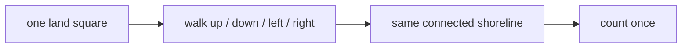
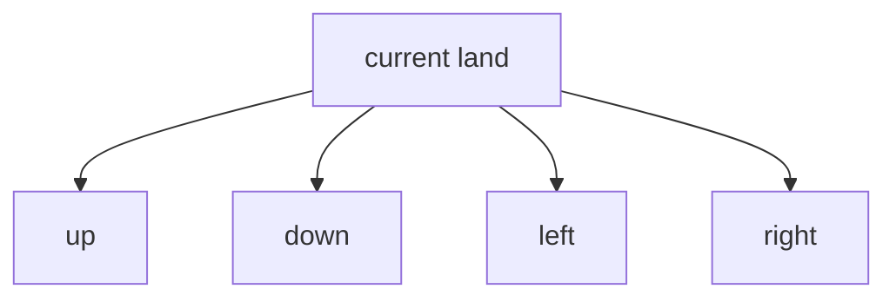

# Number of Islands - Mental Model

## The Problem

Given an `m x n` 2D binary grid `grid` which represents a map of `'1'`s (land) and `'0'`s (water), return the number of islands.

An island is surrounded by water and is formed by connecting adjacent lands horizontally or vertically. You may assume all four edges of the grid are all surrounded by water.

**Example 1:**

```text
Input: grid = [
  ["1","1","1","1","0"],
  ["1","1","0","1","0"],
  ["1","1","0","0","0"],
  ["0","0","0","0","0"]
]
Output: 1
```

**Example 2:**

```text
Input: grid = [
  ["1","1","0","0","0"],
  ["1","1","0","0","0"],
  ["0","0","1","0","0"],
  ["0","0","0","1","1"]
]
Output: 3
```

**Constraints:**

- `m == grid.length`
- `n == grid[i].length`
- `1 <= m, n <= 300`
- `grid[i][j]` is `'0'` or `'1'`

## The Analogy: Survey One Shoreline Until It Disappears

### What are we actually searching for?

We are not counting land cells one by one. We are counting separate landmasses.

That changes the question. The moment I step onto a land cell, I no longer care about that one square by itself. I care about the entire shoreline connected to it. If I can walk from one land square to another by moving up, down, left, or right, they belong to the same island and should count once.



### The mapmaker's rule

Imagine a mapmaker flying over a chain of islands with a can of washable paint. Every time the mapmaker spots a fresh patch of land, they land there, paint that whole connected shoreline, and keep walking outward until no unpainted neighboring land remains.

The paint matters because it changes the question from "have I seen this land before?" to "is this land still unpainted?" Once a square has been painted, it is part of an island we already counted. It should never start a new count.

### How we define one shoreline

Two land squares belong to the same shoreline only if I can walk between them through horizontal or vertical neighbors. Diagonal touching does not make one island, because there is no side-to-side path between those squares.

So each land square has at most four meaningful directions to inspect:

- up
- down
- left
- right



### The property that makes DFS valid

Once I land on one square of an island, depth-first search is just the act of following shoreline paths until they run out.

That works because a connected island has a closure property: every land square in that island is reachable by repeatedly taking one of those four moves from some other land square in the same island. If I paint a square the moment I visit it, I can safely keep walking outward without worrying about loops or double counting. Painted land is done. Unpainted neighboring land is the only work left.

### Testing one shoreline

When I test a starting square, there are only three possibilities:

- it is off the map, so there is nothing to survey
- it is water, so there is nothing to paint
- it is unpainted land, so I paint it and continue into its four neighbors

That is the whole flood-fill idea. One valid land square launches the rest of the survey. Everything else stops immediately.

### How I Think Through This

I think of each island as a shoreline that must be erased from the map the first time I touch it. If a square is water or already erased, it cannot change the island count. If it is fresh land, that square has just proved a new island exists.

From there I switch into survey mode. I paint the current land square first, then walk outward in the four allowed directions until the whole connected shoreline has been erased. When that flood fill finishes, I know every square from that island is gone, so the outer scan can keep moving without double counting.

Take
`grid = [["1","1","0"],["1","0","1"]]`.

:::trace-graph
[
  {
    "nodes": [
      {"id":"a","label":"1","x":20,"y":28,"tone":"current","badge":"start"},
      {"id":"b","label":"1","x":50,"y":28,"tone":"frontier"},
      {"id":"c","label":"0","x":80,"y":28,"tone":"blocked"},
      {"id":"d","label":"1","x":20,"y":72,"tone":"frontier"},
      {"id":"e","label":"0","x":50,"y":72,"tone":"blocked"},
      {"id":"f","label":"1","x":80,"y":72,"tone":"default","badge":"separate"}
    ],
    "edges": [
      {"from":"a","to":"b","tone":"active"},
      {"from":"a","to":"d","tone":"active"}
    ],
    "facts": [
      {"name":"probe", "value":"(0,0)", "tone":"blue"},
      {"name":"new island?", "value":"yes", "tone":"green"}
    ],
    "action":"mark",
    "label":"The first fresh land square proves one island exists. From this starting point, the survey spreads only through side-adjacent land."
  },
  {
    "nodes": [
      {"id":"a","label":"0","x":20,"y":28,"tone":"done"},
      {"id":"b","label":"0","x":50,"y":28,"tone":"done"},
      {"id":"c","label":"0","x":80,"y":28,"tone":"blocked"},
      {"id":"d","label":"0","x":20,"y":72,"tone":"done"},
      {"id":"e","label":"0","x":50,"y":72,"tone":"blocked"},
      {"id":"f","label":"1","x":80,"y":72,"tone":"default","badge":"still unseen"}
    ],
    "edges": [
      {"from":"a","to":"b","tone":"traversed"},
      {"from":"a","to":"d","tone":"traversed"}
    ],
    "facts": [
      {"name":"painted shoreline", "value":"1 island finished", "tone":"green"},
      {"name":"remaining land", "value":"(1,2)", "tone":"orange"}
    ],
    "action":"done",
    "label":"After the flood fill, that whole shoreline is erased. Only truly separate land can trigger the next island count."
  }
]
:::

---

## Building the Algorithm

### Step 1: Paint One Valid Land Square

Start with the smallest meaningful piece of the flood fill: the rule for one square.

If the coordinates are off the map, stop. If the square is water, stop. Otherwise this is unpainted land, so flip it from `'1'` to `'0'`. That single mutation is the first important invariant in the whole problem: once land has been claimed by an island survey, it should never count again.

:::trace-graph
[
  {
    "nodes": [
      {"id":"a","label":"1","x":35,"y":50,"tone":"current","badge":"paint me"},
      {"id":"b","label":"0","x":65,"y":50,"tone":"blocked"}
    ],
    "edges": [],
    "facts": [
      {"name":"cell", "value":"land", "tone":"blue"}
    ],
    "action":"mark",
    "label":"Step 1 teaches the base rule: only unpainted land changes the map, and it changes immediately."
  },
  {
    "nodes": [
      {"id":"a","label":"0","x":35,"y":50,"tone":"done","badge":"painted"},
      {"id":"b","label":"0","x":65,"y":50,"tone":"blocked"}
    ],
    "edges": [],
    "facts": [
      {"name":"result", "value":"won't count again", "tone":"green"}
    ],
    "action":"done",
    "label":"After the flip, this square is no longer fresh land. The island survey now owns it."
  }
]
:::

:::stackblitz{file="step1-problem.ts" step=1 total=3 solution="step1-solution.ts"}

<details>
  <summary>Hints & gotchas</summary>

- **Stop fast on invalid work**: off-map coordinates and water both return immediately.
- **Mark before expanding later**: painting the current square first is what prevents double visits.
- **This step is intentionally tiny**: do not recurse yet. Learn the base rule first.
</details>

### Step 2: Spread That Paint Across the Whole Shoreline

Now finish the flood fill. After painting the current land square, the survey has to continue into the four side-adjacent neighbors. Each recursive call asks the exact same question: off the map, water, or fresh land?

This is where DFS earns its place. The same helper keeps walking until one direction runs out, then backtracks and tries the next direction. When the helper returns, that entire shoreline has been erased from the map.

:::trace-graph
[
  {
    "nodes": [
      {"id":"a","label":"1","x":20,"y":28,"tone":"current"},
      {"id":"b","label":"1","x":50,"y":28,"tone":"frontier"},
      {"id":"c","label":"0","x":80,"y":28,"tone":"blocked"},
      {"id":"d","label":"1","x":20,"y":72,"tone":"frontier"},
      {"id":"e","label":"1","x":50,"y":72,"tone":"frontier"},
      {"id":"f","label":"0","x":80,"y":72,"tone":"blocked"}
    ],
    "edges": [
      {"from":"a","to":"b","tone":"active"},
      {"from":"a","to":"d","tone":"active"},
      {"from":"b","to":"e","tone":"queued"},
      {"from":"d","to":"e","tone":"queued"}
    ],
    "facts": [
      {"name":"current square", "value":"painted first", "tone":"blue"},
      {"name":"next work", "value":"four neighbors", "tone":"orange"}
    ],
    "action":"expand",
    "label":"Step 2 adds the outward walk. One painted square recursively pushes the survey into every side-adjacent land square."
  },
  {
    "nodes": [
      {"id":"a","label":"0","x":20,"y":28,"tone":"done"},
      {"id":"b","label":"0","x":50,"y":28,"tone":"done"},
      {"id":"c","label":"0","x":80,"y":28,"tone":"blocked"},
      {"id":"d","label":"0","x":20,"y":72,"tone":"done"},
      {"id":"e","label":"0","x":50,"y":72,"tone":"done"},
      {"id":"f","label":"0","x":80,"y":72,"tone":"blocked"}
    ],
    "edges": [
      {"from":"a","to":"b","tone":"traversed"},
      {"from":"a","to":"d","tone":"traversed"},
      {"from":"b","to":"e","tone":"traversed"},
      {"from":"d","to":"e","tone":"traversed"}
    ],
    "facts": [
      {"name":"shoreline status", "value":"fully erased", "tone":"green"}
    ],
    "action":"done",
    "label":"When the recursive calls finish, every square in that connected island has been painted away."
  }
]
:::

:::stackblitz{file="step2-problem.ts" step=2 total=3 solution="step2-solution.ts"}

<details>
  <summary>Hints & gotchas</summary>

- **Diagonal cells do not count**: recurse only up, down, left, and right.
- **The current square must flip before the recursive calls**: otherwise neighbors can bounce back into it forever.
- **This helper should erase one whole island**: when it returns, that connected component should be gone.
</details>

### Step 3: Scan the Whole Map and Launch a Survey Only on Fresh Land

With flood fill complete, the outer function becomes simple. Walk every row and every column. When a square is water, keep moving. When a square is fresh land, increment the island count and launch `sinkIsland` from there.

The helper does the hard part. The outer scan just decides when a brand-new island has been discovered. Because each flood fill erases the whole shoreline immediately, no later square from that island can increase the count again.

:::trace-graph
[
  {
    "nodes": [
      {"id":"a","label":"1","x":15,"y":25,"tone":"current","badge":"island 1"},
      {"id":"b","label":"1","x":35,"y":25,"tone":"frontier"},
      {"id":"c","label":"0","x":55,"y":25,"tone":"blocked"},
      {"id":"d","label":"0","x":75,"y":25,"tone":"blocked"},
      {"id":"e","label":"0","x":15,"y":55,"tone":"blocked"},
      {"id":"f","label":"0","x":35,"y":55,"tone":"blocked"},
      {"id":"g","label":"1","x":55,"y":55,"tone":"default","badge":"island 2"},
      {"id":"h","label":"0","x":75,"y":55,"tone":"blocked"},
      {"id":"i","label":"0","x":15,"y":85,"tone":"blocked"},
      {"id":"j","label":"0","x":35,"y":85,"tone":"blocked"},
      {"id":"k","label":"0","x":55,"y":85,"tone":"blocked"},
      {"id":"l","label":"1","x":75,"y":85,"tone":"default","badge":"island 3"}
    ],
    "edges": [
      {"from":"a","to":"b","tone":"active"}
    ],
    "facts": [
      {"name":"count", "value":1, "tone":"green"},
      {"name":"scan position", "value":"first fresh shoreline", "tone":"blue"}
    ],
    "action":"mark",
    "label":"The outer scan finds fresh land, counts one island, then hands control to the flood fill."
  },
  {
    "nodes": [
      {"id":"a","label":"0","x":15,"y":25,"tone":"done"},
      {"id":"b","label":"0","x":35,"y":25,"tone":"done"},
      {"id":"c","label":"0","x":55,"y":25,"tone":"blocked"},
      {"id":"d","label":"0","x":75,"y":25,"tone":"blocked"},
      {"id":"e","label":"0","x":15,"y":55,"tone":"blocked"},
      {"id":"f","label":"0","x":35,"y":55,"tone":"blocked"},
      {"id":"g","label":"1","x":55,"y":55,"tone":"current","badge":"next island"},
      {"id":"h","label":"0","x":75,"y":55,"tone":"blocked"},
      {"id":"i","label":"0","x":15,"y":85,"tone":"blocked"},
      {"id":"j","label":"0","x":35,"y":85,"tone":"blocked"},
      {"id":"k","label":"0","x":55,"y":85,"tone":"blocked"},
      {"id":"l","label":"1","x":75,"y":85,"tone":"default","badge":"later"}
    ],
    "edges": [],
    "facts": [
      {"name":"count", "value":1, "tone":"green"},
      {"name":"why keep scanning?", "value":"separate land remains", "tone":"orange"}
    ],
    "action":"visit",
    "label":"After island 1 is erased, the scan keeps moving. Only truly separate land can raise the count again."
  },
  {
    "nodes": [
      {"id":"a","label":"0","x":15,"y":25,"tone":"done"},
      {"id":"b","label":"0","x":35,"y":25,"tone":"done"},
      {"id":"c","label":"0","x":55,"y":25,"tone":"blocked"},
      {"id":"d","label":"0","x":75,"y":25,"tone":"blocked"},
      {"id":"e","label":"0","x":15,"y":55,"tone":"blocked"},
      {"id":"f","label":"0","x":35,"y":55,"tone":"blocked"},
      {"id":"g","label":"0","x":55,"y":55,"tone":"done"},
      {"id":"h","label":"0","x":75,"y":55,"tone":"blocked"},
      {"id":"i","label":"0","x":15,"y":85,"tone":"blocked"},
      {"id":"j","label":"0","x":35,"y":85,"tone":"blocked"},
      {"id":"k","label":"0","x":55,"y":85,"tone":"blocked"},
      {"id":"l","label":"0","x":75,"y":85,"tone":"done"}
    ],
    "edges": [],
    "facts": [
      {"name":"final count", "value":3, "tone":"green"}
    ],
    "action":"done",
    "label":"Each fresh shoreline triggers exactly one flood fill, so the final count equals the number of separate islands."
  }
]
:::

:::stackblitz{file="step3-problem.ts" step=3 total=3 solution="step3-solution.ts"}

<details>
  <summary>Hints & gotchas</summary>

- **Count before you erase**: the current fresh land square is the proof that a new island exists.
- **Reuse the helper exactly as built**: the outer scan should launch flood fill, not reimplement it.
- **Mutation is the visited set**: once a flood fill runs, later scan positions from that island will already be `'0'`.
</details>

## Tracing through an Example

Take
`grid = [["1","1","0","0"],["1","0","0","1"],["0","0","1","1"]]`.

:::trace-graph
[
  {
    "nodes": [
      {"id":"a","label":"1","x":15,"y":20,"tone":"current"},
      {"id":"b","label":"1","x":35,"y":20,"tone":"frontier"},
      {"id":"c","label":"0","x":55,"y":20,"tone":"blocked"},
      {"id":"d","label":"0","x":75,"y":20,"tone":"blocked"},
      {"id":"e","label":"1","x":15,"y":50,"tone":"frontier"},
      {"id":"f","label":"0","x":35,"y":50,"tone":"blocked"},
      {"id":"g","label":"0","x":55,"y":50,"tone":"blocked"},
      {"id":"h","label":"1","x":75,"y":50,"tone":"default"},
      {"id":"i","label":"0","x":15,"y":80,"tone":"blocked"},
      {"id":"j","label":"0","x":35,"y":80,"tone":"blocked"},
      {"id":"k","label":"1","x":55,"y":80,"tone":"default"},
      {"id":"l","label":"1","x":75,"y":80,"tone":"default"}
    ],
    "edges": [
      {"from":"a","to":"b","tone":"active"},
      {"from":"a","to":"e","tone":"active"},
      {"from":"h","to":"l","tone":"muted"},
      {"from":"k","to":"l","tone":"muted"}
    ],
    "facts": [
      {"name":"count", "value":1, "tone":"green"}
    ],
    "action":"mark",
    "label":"The scan hits `(0,0)`, counts island 1, and flood fill erases the whole top-left shoreline."
  },
  {
    "nodes": [
      {"id":"a","label":"0","x":15,"y":20,"tone":"done"},
      {"id":"b","label":"0","x":35,"y":20,"tone":"done"},
      {"id":"c","label":"0","x":55,"y":20,"tone":"blocked"},
      {"id":"d","label":"0","x":75,"y":20,"tone":"blocked"},
      {"id":"e","label":"0","x":15,"y":50,"tone":"done"},
      {"id":"f","label":"0","x":35,"y":50,"tone":"blocked"},
      {"id":"g","label":"0","x":55,"y":50,"tone":"blocked"},
      {"id":"h","label":"1","x":75,"y":50,"tone":"current"},
      {"id":"i","label":"0","x":15,"y":80,"tone":"blocked"},
      {"id":"j","label":"0","x":35,"y":80,"tone":"blocked"},
      {"id":"k","label":"1","x":55,"y":80,"tone":"frontier"},
      {"id":"l","label":"1","x":75,"y":80,"tone":"frontier"}
    ],
    "edges": [
      {"from":"h","to":"l","tone":"active"},
      {"from":"k","to":"l","tone":"active"}
    ],
    "facts": [
      {"name":"count", "value":2, "tone":"green"}
    ],
    "action":"expand",
    "label":"Later the scan reaches `(1,3)`, which is still fresh land. That starts island 2 and spreads through the connected bottom-right shoreline."
  },
  {
    "nodes": [
      {"id":"a","label":"0","x":15,"y":20,"tone":"done"},
      {"id":"b","label":"0","x":35,"y":20,"tone":"done"},
      {"id":"c","label":"0","x":55,"y":20,"tone":"blocked"},
      {"id":"d","label":"0","x":75,"y":20,"tone":"blocked"},
      {"id":"e","label":"0","x":15,"y":50,"tone":"done"},
      {"id":"f","label":"0","x":35,"y":50,"tone":"blocked"},
      {"id":"g","label":"0","x":55,"y":50,"tone":"blocked"},
      {"id":"h","label":"0","x":75,"y":50,"tone":"done"},
      {"id":"i","label":"0","x":15,"y":80,"tone":"blocked"},
      {"id":"j","label":"0","x":35,"y":80,"tone":"blocked"},
      {"id":"k","label":"0","x":55,"y":80,"tone":"done"},
      {"id":"l","label":"0","x":75,"y":80,"tone":"done"}
    ],
    "edges": [
      {"from":"h","to":"l","tone":"traversed"},
      {"from":"k","to":"l","tone":"traversed"}
    ],
    "facts": [
      {"name":"final count", "value":2, "tone":"green"}
    ],
    "action":"done",
    "label":"Once the second shoreline is erased, the scan finishes with no fresh land left. The answer is 2."
  }
]
:::

## Recognizing This Pattern

- Reach for this pattern when the input is a grid, board, or map and the real question is "how many connected regions exist?" or "erase one region at a time."
- The structural property is connectivity: once one square in a region is found, repeated neighbor moves can reach every other square in that same region.
- DFS flood fill beats brute force recounting because each square is processed at most once. You do not restart full searches from every land cell, you erase a whole island the first time you touch it.

## Complete Solution

:::stackblitz{file="solution.ts" step=3 total=3 solution="solution.ts"}
