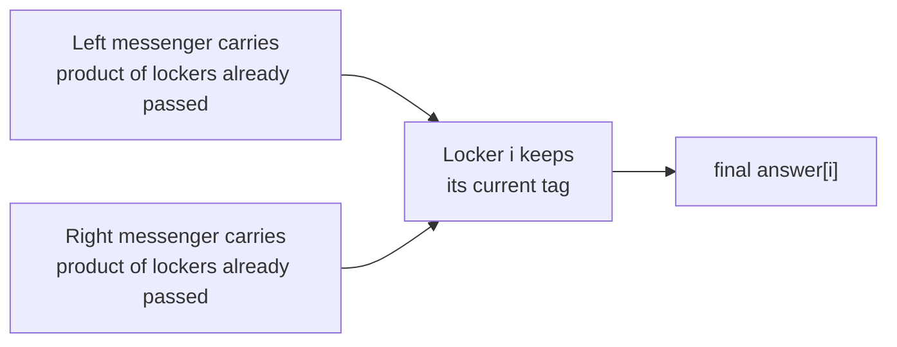
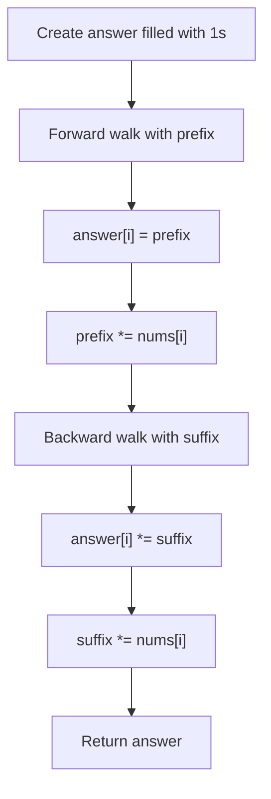

# Product of Array Except Self — Mental Model

## The Problem

Given an integer array `nums`, return an array `answer` such that `answer[i]` is equal to the product of all the elements of `nums` except `nums[i]`.

The product of any prefix or suffix of `nums` is guaranteed to fit in a 32-bit integer.

You must write an algorithm that runs in `O(n)` time and without using the division operation.

**Example 1:**

```
Input: nums = [1,2,3,4]
Output: [24,12,8,6]
```

**Example 2:**

```
Input: nums = [-1,1,0,-3,3]
Output: [0,0,9,0,0]
```

## The Two Messengers and the Locker Tags

### What are we actually building?

We are not looking for one grand product and then "undoing" one locker at a time. The no-division rule takes that shortcut away. Instead, each locker needs its own tag built from two separate pieces:

- everything stored to its left
- everything stored to its right

If a locker can collect those two pieces, it has everything except itself.

So the real job is: for every position, record what came before it, then later combine that with what comes after it.

### The two messengers

Imagine a hallway of lockers. A left messenger walks from the start of the hallway to the end. As they walk, they carry one running bundle, the product of everything they have already passed. When they reach locker `i`, they pin that running bundle onto locker `i`'s tag. Then they multiply their bundle by `nums[i]` and keep walking.

A right messenger does the mirror image. They start at the far end with their own running bundle, the product of everything already passed from the right. When they reach locker `i`, they multiply that right-side bundle into the tag that is already hanging there.

That means no locker ever needs to know the full hallway at once. It only needs one visit from each messenger.



### How the locker tags start

Every locker starts with a blank tag whose value is `1`. That matters because `1` is multiplication's neutral value. If a locker has nothing on one side, that side should contribute "nothing extra," not break the product.

So the tag array starts as all ones. The left messenger's visit overwrites each tag with the left-side product. The right messenger's visit multiplies the right-side product into that same tag.

This is why we do not need two extra arrays. The tag itself can first hold the left story, then become the full story.

### Why this split works

Each locker cuts the hallway into two independent sides. Everything before index `i` belongs to the left bundle. Everything after index `i` belongs to the right bundle. Nothing overlaps, and `nums[i]` itself belongs to neither bundle.

Because multiplication is associative, the final tag does not care how each side was accumulated. It only cares that the left messenger truly carries "everything before me" and the right messenger truly carries "everything after me."

That is the invariant:

- before the left messenger writes at index `i`, `prefix` equals the product of `nums[0..i-1]`
- before the right messenger multiplies at index `i`, `suffix` equals the product of `nums[i+1..n-1]`

Zeros fit naturally into this model. If a zero lies on one side of a locker, that side's running bundle becomes zero from that point on. We do not need a special branch for it.

### Testing one locker

Pick one locker in the middle. Ask two separate questions:

- what product would the left messenger be carrying when they arrive here?
- what product would the right messenger be carrying when they arrive here?

Those two values are exactly the answer for that locker.

That is why the forward pass writes before multiplying by the current locker, and the backward pass also multiplies before absorbing the current locker. Each messenger must arrive carrying only the product of lockers already passed, never including the current one.

### How I Think Through This

I think of the answer array as a row of blank locker tags. On the first walk, I am only responsible for the left side of each locker. When I reach index `i`, the running `prefix` already represents every locker before `i`, so that is exactly what belongs on `answer[i]`.

On the second walk, I come from the right with a running `suffix`. Now each locker already has its left-side tag, so I do not replace it. I multiply the right-side bundle into it. After both walks, the tag at each locker holds everything except the locker itself.

Take `[1, 2, 3, 4]`.

:::trace-ps
[
  {"nums":[1,2,3,4],"result":[1,1,2,1],"currentI":2,"pass":"forward","accumulator":2,"accName":"prefix","label":"Forward pass at locker 2: prefix = 1×2 = 2, so the left messenger writes 2 onto answer[2]."},
  {"nums":[1,2,3,4],"result":[24,12,8,6],"currentI":2,"pass":"backward","accumulator":4,"accName":"suffix","label":"Backward pass at locker 2: suffix = 4, so the right messenger multiplies answer[2] by 4 and finishes that locker's tag as 8."}
]
:::

## Building the Algorithm

### Step 1: Let the left messenger write every left-side product

Start by giving every locker a tag of `1`. Then walk from left to right with a running `prefix`. At each locker, write the current `prefix` onto its tag, then absorb the current locker into `prefix` before moving on.

This step does not solve the full problem yet, but it builds a real piece of the final answer: after the pass, every tag correctly knows the product of everything to its left.

:::trace-ps
[
  {"nums":[2,3,4,5],"result":[1,1,1,1],"currentI":0,"pass":"forward","accumulator":1,"accName":"prefix","label":"Start with prefix = 1. Locker 0 has nothing to its left, so its tag gets 1."},
  {"nums":[2,3,4,5],"result":[1,2,1,1],"currentI":1,"pass":"forward","accumulator":2,"accName":"prefix","label":"At locker 1, prefix = 2, so answer[1] gets 2."},
  {"nums":[2,3,4,5],"result":[1,2,6,1],"currentI":2,"pass":"forward","accumulator":6,"accName":"prefix","label":"At locker 2, prefix = 2×3 = 6, so answer[2] gets 6."},
  {"nums":[2,3,4,5],"result":[1,2,6,24],"currentI":3,"pass":"forward","accumulator":24,"accName":"prefix","label":"At locker 3, prefix = 2×3×4 = 24, so answer[3] gets 24."},
  {"nums":[2,3,4,5],"result":[1,2,6,24],"currentI":-1,"pass":"done","accumulator":0,"accName":"","label":"After the forward walk, each tag holds only the left-side product. The right-side story is still missing."}
]
:::

:::stackblitz{file="step1-problem.ts" step=1 total=2 solution="step1-solution.ts"}

<details>
<summary>Hints & gotchas</summary>

- Write `answer[i] = prefix` before `prefix *= nums[i]`. The messenger must arrive carrying only lockers already passed.
- Start `prefix` at `1`, not `0`. A locker with nothing on the left should keep the multiplication neutral value.
- Filling `answer` with `1`s is not a trick, it is part of the model. Later lockers may still be waiting for the second messenger.

</details>

### Step 2: Let the right messenger finish each tag

Now walk from right to left with a running `suffix`. When you reach locker `i`, the tag already contains the left-side product from Step 1. Multiply `suffix` into that tag, then absorb `nums[i]` into `suffix` before moving left again.

This completes each locker in place. The same tag first stores "everything before me," then becomes "everything before me times everything after me."

:::trace-ps
[
  {"nums":[2,3,4,5],"result":[1,2,6,24],"currentI":3,"pass":"backward","accumulator":1,"accName":"suffix","label":"Start backward with suffix = 1. Locker 3 has nothing to its right, so its tag stays 24."},
  {"nums":[2,3,4,5],"result":[1,2,30,24],"currentI":2,"pass":"backward","accumulator":5,"accName":"suffix","label":"At locker 2, suffix = 5. Multiply answer[2] by 5 to get 30."},
  {"nums":[2,3,4,5],"result":[1,40,30,24],"currentI":1,"pass":"backward","accumulator":20,"accName":"suffix","label":"At locker 1, suffix = 4×5 = 20. Multiply answer[1] by 20 to get 40."},
  {"nums":[2,3,4,5],"result":[60,40,30,24],"currentI":0,"pass":"backward","accumulator":60,"accName":"suffix","label":"At locker 0, suffix = 3×4×5 = 60. Multiply answer[0] by 60 to get 60."},
  {"nums":[2,3,4,5],"result":[60,40,30,24],"currentI":-1,"pass":"done","accumulator":0,"accName":"","label":"Now every locker tag is complete: left-side product times right-side product."}
]
:::

:::stackblitz{file="step2-problem.ts" step=2 total=2 solution="step2-solution.ts"}

<details>
<summary>Hints & gotchas</summary>

- The backward pass mirrors the forward one: use `answer[i] *= suffix` before `suffix *= nums[i]`.
- You do not need a second array for right-side products. `suffix` is enough because each locker only needs the running product at the moment you arrive.
- Zeros do not need special-case code. If `suffix` or `prefix` becomes zero, that is the correct contribution for every locker beyond that point on that side.

</details>

## The Messengers' Route Map



## Tracing through an Example

Use a fresh example: `nums = [3, 1, 2, 6]`

:::trace-ps
[
  {"nums":[3,1,2,6],"result":[1,1,1,1],"currentI":0,"pass":"forward","accumulator":1,"accName":"prefix","label":"Locker 0 has nothing to its left, so answer[0] = 1."},
  {"nums":[3,1,2,6],"result":[1,3,1,1],"currentI":1,"pass":"forward","accumulator":3,"accName":"prefix","label":"Locker 1 gets the product of lockers before it: 3."},
  {"nums":[3,1,2,6],"result":[1,3,3,1],"currentI":2,"pass":"forward","accumulator":3,"accName":"prefix","label":"Locker 2 gets 3×1 = 3."},
  {"nums":[3,1,2,6],"result":[1,3,3,6],"currentI":3,"pass":"forward","accumulator":6,"accName":"prefix","label":"Locker 3 gets 3×1×2 = 6."},
  {"nums":[3,1,2,6],"result":[1,3,3,6],"currentI":3,"pass":"backward","accumulator":1,"accName":"suffix","label":"Start backward. Locker 3 has nothing to its right, so its tag stays 6."},
  {"nums":[3,1,2,6],"result":[1,3,18,6],"currentI":2,"pass":"backward","accumulator":6,"accName":"suffix","label":"Locker 2 multiplies in the right-side product 6, becoming 18."},
  {"nums":[3,1,2,6],"result":[1,36,18,6],"currentI":1,"pass":"backward","accumulator":12,"accName":"suffix","label":"Locker 1 multiplies in 2×6 = 12, becoming 36."},
  {"nums":[3,1,2,6],"result":[12,36,18,6],"currentI":0,"pass":"backward","accumulator":12,"accName":"suffix","label":"Locker 0 multiplies in 1×2×6 = 12, becoming 12. Final answer: [12, 36, 18, 6]."},
  {"nums":[3,1,2,6],"result":[12,36,18,6],"currentI":-1,"pass":"done","accumulator":0,"accName":"","label":"Both messengers have visited every locker, so all tags are complete."}
]
:::

## Recognizing This Pattern

- Reach for this when each answer at index `i` depends on "everything before me" and "everything after me," especially when division is forbidden.
- The structural property is a clean split around each index: the array naturally breaks into an independent left product and right product.
- A brute-force nested scan recomputes the same partial products over and over. Prefix and suffix passes reuse that work, dropping the cost from `O(n²)` to `O(n)`.

## Complete Solution

:::stackblitz{file="solution.ts" step=2 total=2 solution="solution.ts"}
