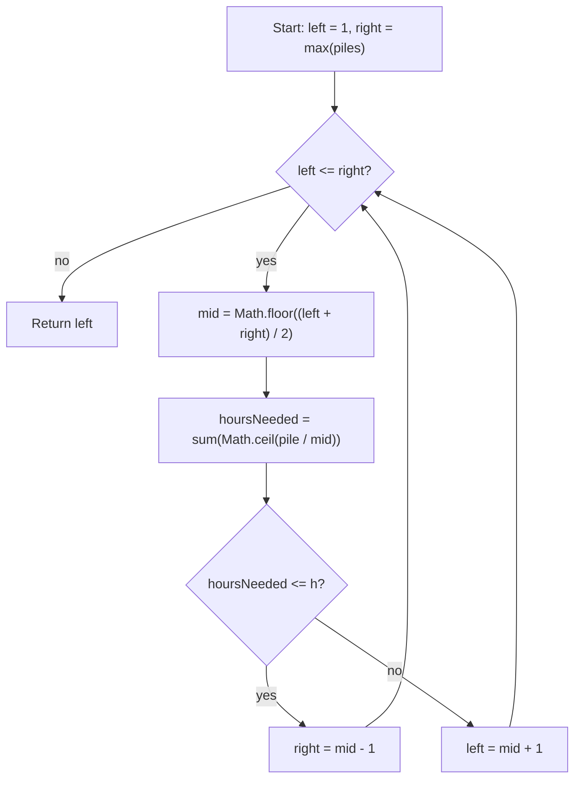

# Koko Eating Bananas - Mental Model

## The Problem

Koko loves to eat bananas. There are `n` piles of bananas, the `i`th pile has `piles[i]` bananas. The guards have gone and will come back in `h` hours.

Koko can decide her bananas-per-hour eating speed of `k`. Each hour, she chooses some pile of bananas and eats `k` bananas from that pile. If the pile has fewer than `k` bananas, she eats all of them instead, and will not eat any more bananas during that hour.

Koko likes to eat slowly but still wants to finish eating all the bananas before the guards return.

Return the minimum integer `k` such that she can eat all the bananas within `h` hours.

**Example 1:**
```
Input: piles = [3,6,7,11], h = 8
Output: 4
```

**Example 2:**
```
Input: piles = [30,11,23,4,20], h = 5
Output: 30
```

**Example 3:**
```
Input: piles = [30,11,23,4,20], h = 6
Output: 23
```

## The Analogy: The Guard's Deadline

### What are we actually searching for?

Koko wants to eat as slowly as possible, but she has a hard deadline. She is not looking for a speed that was decided in advance — she is asking: what is the minimum speed where I still finish before the guards return?

That reframes the problem. The question is not "does speed 7 work?" It is "where does 'works' first become true?" Once you see it that way, you are not solving a calculation problem. You are searching for a boundary.

### The Speed Dial

Think of every possible eating speed as a dial with numbered notches. Turn it all the way left and Koko barely eats anything per hour — she will never finish in time. Turn it all the way right and she tears through every pile as fast as possible.

Somewhere on that dial there is a boundary. Every notch to the left of it is too slow. Every notch at or to the right of it is fast enough. Your job is to find that boundary — specifically the leftmost notch that still works.

### How we define the range

Each pile has a floor: one hour. Koko works on one pile per hour and cannot do less than that, no matter how fast she eats.

The bigger a pile is, the faster she needs to eat to clear it in that one hour. A small pile hits its floor at a low speed. A large pile needs a higher speed to get there. The biggest pile is the hardest — it needs the highest speed. But once her speed reaches the size of that pile, every smaller pile already fits in one hour too.

That is why `max(piles)` is the ceiling. It is the speed at which every pile — including the hardest one — has hit its floor. Searching beyond it changes nothing.

So the range we search is every candidate speed from `1` to `max(piles)`. That range is just a sorted list of integers — not the pile array. `piles` never gets searched. It only appears when we evaluate a candidate speed to see how many total hours it would take.

### The one flip that makes binary search valid

Every speed that works has one property: every faster speed also works. Every speed that fails has one property: every slower speed also fails. The boundary between them flips exactly once — from "too slow" to "fast enough" — and never flips back.

That single flip is what makes Binary Search the right tool. You do not need to test every notch. You probe the middle of the remaining range, check whether it finishes in time, and cut the range in half. The boundary always survives in one half or the other.

### Testing a speed

To test any candidate speed, you walk every pile and calculate how many hours that pile would take at that speed. A pile rarely divides evenly — any leftover bananas still cost a full hour, so you always round up. Sum those hours across every pile. If the total fits within `h`, the speed works. If not, it fails. That check is all you need to decide which half of the dial to keep searching.

### How I Think Through This

I picture Koko starting in the middle of the dial rather than the slow end. I probe that midpoint, total the hours across every pile, and ask: does this fit the deadline?

If it does, I do not stop — there might be a slower notch that also works. I squeeze left. If it does not, I move right. Each probe cuts the remaining dial in half.

When the two cursors cross, `left` is sitting on the first notch that survived every test. That is the answer.

Take `piles = [3, 6, 7, 11]`, `h = 8`.

:::trace-bs
[
  {"values":[1,2,3,4,5,6,7,8,9,10,11],"left":0,"mid":5,"right":10,"action":"check","label":"Probe speed 6. Hours needed: ceil(3/6) + ceil(6/6) + ceil(7/6) + ceil(11/6) = 1 + 1 + 2 + 2 = 6. Fits within 8 — a slower speed might also work, so squeeze left."},
  {"values":[1,2,3,4,5,6,7,8,9,10,11],"left":0,"mid":2,"right":4,"action":"candidate","label":"Speed 6 worked, so the boundary must lie somewhere in speeds 1 through 5. The window has been cut in half — keep probing."}
]
:::

---

## Building the Algorithm

### Step 1: Build the Hours Helper

Before you can probe any notch on the dial, you need a way to test it. Write `canFinishAtSpeed` — walk each pile in `piles`, figure out how many hours that pile costs at speed `k`, and return whether the total stays within `h`.

Why `Math.ceil(pile / k)`? Koko works on one pile per hour and any leftover capacity in that hour is gone. A pile of 7 bananas at speed 3 takes 3 hours, not 2.33 — the partial third sitting still costs a full hour. Rounding up captures that.

:::stackblitz{file="step1-problem.ts" step=1 total=3 solution="step1-solution.ts"}

<details>
  <summary>Hints & gotchas</summary>

- **Partial sittings still cost a full hour**: a pile with 7 bananas at speed 3 costs 3 hours, not 2.33.
- **One pile per iteration**: sum the hour cost across every pile, not just the largest.
- **Return a boolean**: the binary search only needs to know if this speed works, not the raw hour count.
</details>

### Step 2: Find a Working Speed

Now set up the dial. The left edge is `1` — the slowest speed that makes any progress. The right edge is `max(piles)` — at that speed, Koko clears the biggest pile in exactly one hour, so going faster would not reduce the total hour count any further. Those two ends define the only notches worth searching.

Set up a [Binary Search](/fundamentals/binary-search) over that range, probe the midpoint, and call `canFinishAtSpeed`. If the midpoint works, return it. For now, don't worry about whether it is the minimum.

Take `piles = [8, 8, 8, 8]`, `h = 8`.

:::trace-bs
[
  {"values":[1,2,3,4,5,6,7,8],"left":0,"mid":3,"right":7,"action":"check","label":"Probe speed 4. It needs exactly 8 hours, so it works. Return 4."},
  {"values":[1,2,3,4,5,6,7,8],"left":0,"mid":3,"right":7,"action":"candidate","label":"Speed 4 happens to be the minimum here, but Step 2 returns it simply because it works — the minimality check comes in Step 3."}
]
:::

:::stackblitz{file="step2-problem.ts" step=2 total=3 solution="step2-solution.ts"}

<details>
  <summary>Hints & gotchas</summary>

- **The midpoint is a speed, not an index**: search from `1` to `max(piles)`.
- **Use your helper**: call `canFinishAtSpeed(piles, h, mid)` to test the midpoint.
- **Just return mid for now**: the goal is to confirm the binary search structure works before adding the squeeze logic.
</details>

### Step 3: Squeeze to the Minimum Working Speed

Finding *a* working speed is not the goal — finding the *minimum* working speed is. When a notch works, you cannot stop; there might be a slower one that also works. Replace `return mid` with `right = mid - 1` to keep squeezing left. Fill in the failing branch with `left = mid + 1`. After the loop, `left` is sitting on the leftmost notch that survived every test — the boundary you were hunting for.

Take `piles = [30, 11, 23, 4, 20]`, `h = 6`.

:::trace-bs
[
  {"values":[1,2,3,4,5,6,7,8,9,10,11,12,13,14,15,16,17,18,19,20,21,22,23,24,25,26,27,28,29,30],"left":0,"mid":14,"right":29,"action":"check","label":"Probe speed 15. That needs 2 + 1 + 2 + 1 + 2 = 8 hours, so 15 is too slow."},
  {"values":[1,2,3,4,5,6,7,8,9,10,11,12,13,14,15,16,17,18,19,20,21,22,23,24,25,26,27,28,29,30],"left":15,"mid":22,"right":29,"action":"discard-left","label":"Move rightward and probe speed 23. That needs 2 + 1 + 1 + 1 + 1 = 6 hours, so 23 works."},
  {"values":[1,2,3,4,5,6,7,8,9,10,11,12,13,14,15,16,17,18,19,20,21,22,23,24,25,26,27,28,29,30],"left":15,"mid":18,"right":21,"action":"candidate","label":"Squeeze left to look for a slower working speed. Probe speed 19. That needs 2 + 1 + 2 + 1 + 2 = 8 hours, so 19 fails."},
  {"values":[1,2,3,4,5,6,7,8,9,10,11,12,13,14,15,16,17,18,19,20,21,22,23,24,25,26,27,28,29,30],"left":19,"mid":20,"right":21,"action":"check","label":"Probe speed 21. That still needs 7 hours, so it fails too."},
  {"values":[1,2,3,4,5,6,7,8,9,10,11,12,13,14,15,16,17,18,19,20,21,22,23,24,25,26,27,28,29,30],"left":21,"mid":21,"right":21,"action":"check","label":"Probe speed 22. That still needs 7 hours, so it also fails."},
  {"values":[1,2,3,4,5,6,7,8,9,10,11,12,13,14,15,16,17,18,19,20,21,22,23,24,25,26,27,28,29,30],"left":22,"mid":null,"right":21,"action":"done","label":"The boundaries cross with the answer pointer on speed 23. That is the first working setting, so return 23."}
]
:::

:::stackblitz{file="step3-problem.ts" step=3 total=3 solution="step3-solution.ts"}

<details>
  <summary>Hints & gotchas</summary>

- **If a speed works, search left**: you are hunting for the slowest setting that still finishes on time.
- **If a speed fails, search right**: every slower speed also fails, so there is nothing to keep on the left.
- **`left` becomes the answer**: once the boundaries cross, every smaller speed has been disproved.
</details>

## Tracing through an Example

Take `piles = [25, 10, 23, 4]`, `h = 7`.

:::trace-bs
[
  {"values":[1,2,3,4,5,6,7,8,9,10,11,12,13,14,15,16,17,18,19,20,21,22,23,24,25],"left":0,"mid":12,"right":24,"action":"check","label":"Start with the full speed dial. Probe speed 13. Hours needed: 2 + 1 + 2 + 1 = 6, so this speed works."},
  {"values":[1,2,3,4,5,6,7,8,9,10,11,12,13,14,15,16,17,18,19,20,21,22,23,24,25],"left":0,"mid":5,"right":11,"action":"candidate","label":"Squeeze left and probe speed 6. Hours needed: 5 + 2 + 4 + 1 = 12, so this speed fails."},
  {"values":[1,2,3,4,5,6,7,8,9,10,11,12,13,14,15,16,17,18,19,20,21,22,23,24,25],"left":6,"mid":8,"right":11,"action":"check","label":"Probe speed 9. Hours needed: 3 + 2 + 3 + 1 = 9, so this speed still fails."},
  {"values":[1,2,3,4,5,6,7,8,9,10,11,12,13,14,15,16,17,18,19,20,21,22,23,24,25],"left":9,"mid":10,"right":11,"action":"check","label":"Probe speed 11. Hours needed: 3 + 1 + 3 + 1 = 8, so this speed still fails."},
  {"values":[1,2,3,4,5,6,7,8,9,10,11,12,13,14,15,16,17,18,19,20,21,22,23,24,25],"left":11,"mid":11,"right":11,"action":"check","label":"Probe speed 12. Hours needed: 3 + 1 + 2 + 1 = 7, so this speed works."},
  {"values":[1,2,3,4,5,6,7,8,9,10,11,12,13,14,15,16,17,18,19,20,21,22,23,24,25],"left":11,"mid":null,"right":10,"action":"done","label":"The boundaries cross with the answer pointer on speed 12. That is the minimum speed that finishes within 7 hours."}
]
:::

## Speed Dial at a Glance



## Recognizing This Pattern

Reach for binary search on an answer space when three things are true:

- The problem asks for a minimum or maximum value, not a position in an array.
- That value lives in a natural sorted range — here, every integer from `1` to `max(piles)`.
- There is a monotonic condition: if speed `k` works, then `k + 1` also works; if `k` fails, `k - 1` also fails. One flip, never two.

The tell is when you catch yourself thinking "I need to check every possible value" — that is the brute-force instinct. When checking one candidate is cheap (one pass through `piles`) but the range is large, binary search on that range collapses the work from O(n · max) to O(n · log max).

## Complete Solution

:::stackblitz{file="solution.ts" step=3 total=3 solution="solution.ts"}
