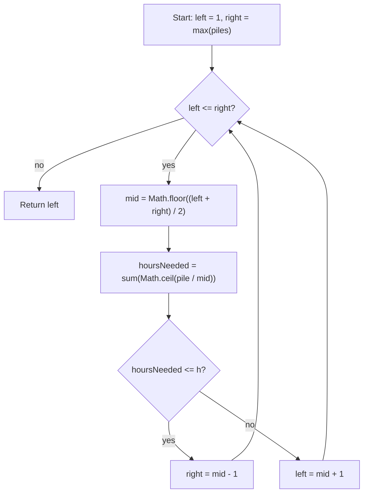

# Koko Eating Bananas - Mental Model

## The Problem

Koko loves to eat bananas. There are `n` piles of bananas, the `i`th pile has `piles[i]` bananas. The guards have gone and will come back in `h` hours.

Koko can decide her bananas-per-hour eating speed of `k`. Each hour, she chooses some pile of bananas and eats `k` bananas from that pile. If the pile has fewer than `k` bananas, she eats all of them instead, and will not eat any more bananas during that hour.

Koko likes to eat slowly but still wants to finish eating all the bananas before the guards return.

Return the minimum integer `k` such that she can eat all the bananas within `h` hours.

**Example 1:**
```
Input: piles = [3,6,7,11], h = 8
Output: 4
```

**Example 2:**
```
Input: piles = [30,11,23,4,20], h = 5
Output: 30
```

**Example 3:**
```
Input: piles = [30,11,23,4,20], h = 6
Output: 23
```

## The Guard's Deadline

Koko wants to eat as slowly as possible. That sounds simple, but it changes how you think about the search. She is not looking for a specific speed that was decided in advance. She is asking: what is the minimum speed where I still finish before the guards return?

That reframes the problem. The question is not "does speed 7 work?" It is "where does 'works' first become true on the speed range?" Every speed that works has one property: every faster speed also works. Every speed that fails has one property: every slower speed also fails. The boundary between them flips exactly once.

That single flip is what makes Binary Search the right tool. Koko does not need to test every speed from 1 upward. She probes the middle of the remaining range, checks whether it finishes in time, and cuts the range in half. The boundary she is hunting always survives in one half or the other.

## Understanding the Analogy

### The Setup

The speed range runs from 1 banana per hour up to `max(piles)`. Koko never needs to eat faster than the largest pile, because at that speed she already clears any single pile in one hour. Going faster would not reduce the hour count any further.

That gives the search range: `left = 1`, `right = max(piles)`. Koko does not need to find any working speed. She needs the slowest one, so the search always squeezes from the fast end toward the slow end.

### Testing One Speed

To test a candidate speed, total the hours each pile would cost at that rate. A pile of size `pile` at speed `k` costs `Math.ceil(pile / k)` hours, because Koko works on one pile per hour and any leftover capacity in that hour is gone. Adding that cost across every pile gives the total hours needed at this speed.

That total is the test:

- if total hours <= `h`, this speed finishes in time
- if total hours > `h`, this speed is too slow

### Why This Approach

Testing every speed from 1 upward works but ignores the structure of the problem. If `k` finishes in time, every faster speed also does. If `k` fails, every slower speed also fails. Feasibility only moves in one direction.

Binary Search uses that structure. Each probe cuts the remaining range in half, which is why the search takes `O(n log max(piles))` instead of `O(n * max(piles))`.

## How I Think Through This

I think of Koko starting in the middle of the speed range rather than the slow end. At each candidate speed, I total the hours across every pile. If the total fits the deadline, I try something slower. If it does not fit, I have to speed up.

The shift from a normal binary search is that I am not looking for a specific value. I am hunting for where "finishes in time" first becomes true, starting from the fast side and squeezing left. So when a speed works, I do not stop. I keep searching slower. When the boundaries cross, the pointer lands on the slowest speed that survived every test.

Take `piles = [3, 6, 7, 11]`, `h = 8`.

:::trace-bs
[
  {"values":[1,2,3,4,5,6,7,8,9,10,11],"left":0,"mid":5,"right":10,"action":"check","label":"Probe speed 6. Hours needed: 1 + 1 + 2 + 2 = 6, which fits within 8. A slower speed might also work, so search left."},
  {"values":[1,2,3,4,5,6,7,8,9,10,11],"left":0,"mid":2,"right":4,"action":"candidate","label":"The window now covers only speeds 1 through 5. Building the Algorithm walks through the rest."}
]
:::

---

## Building the Algorithm

### Step 1: Build the Hours Helper

Before the search can begin, you need a way to test any candidate speed. Write `canFinishAtSpeed` — walk each pile in `piles`, figure out how many hours that pile costs at speed `k`, and return whether the total stays within `h`.

The key detail: Koko works on one pile per hour and any leftover capacity in that hour is gone. A pile she cannot clear in one sitting still costs a full hour per sitting.

:::stackblitz{file="step1-problem.ts" step=1 total=3 solution="step1-solution.ts"}

<details>
  <summary>Hints & gotchas</summary>

- **Partial sittings still cost a full hour**: a pile with 7 bananas at speed 3 costs 3 hours, not 2.33.
- **One pile per iteration**: sum the hour cost across every pile, not just the largest.
- **Return a boolean**: the binary search only needs to know if this speed works, not the raw hour count.
</details>

### Step 2: Find a Working Speed

Set up a [Binary Search](/fundamentals/binary-search) over the range of possible speeds — from `1` to `max(piles)` — probe the midpoint, and call `canFinishAtSpeed`. If the midpoint works, return it. For now, don't worry about whether it is the minimum.

Take `piles = [8, 8, 8, 8]`, `h = 8`.

:::trace-bs
[
  {"values":[1,2,3,4,5,6,7,8],"left":0,"mid":3,"right":7,"action":"check","label":"Probe speed 4. It needs exactly 8 hours, so it works. Return 4."},
  {"values":[1,2,3,4,5,6,7,8],"left":0,"mid":3,"right":7,"action":"candidate","label":"Speed 4 happens to be the minimum here, but Step 2 returns it simply because it works — the minimality check comes in Step 3."}
]
:::

:::stackblitz{file="step2-problem.ts" step=2 total=3 solution="step2-solution.ts"}

<details>
  <summary>Hints & gotchas</summary>

- **The midpoint is a speed, not an index**: search from `1` to `max(piles)`.
- **Use your helper**: call `canFinishAtSpeed(piles, h, mid)` to test the midpoint.
- **Just return mid for now**: the goal is to confirm the binary search structure works before adding the squeeze logic.
</details>

### Step 3: Squeeze to the Minimum Working Speed

Returning `mid` finds a working speed, but not necessarily the minimum. Replace `return mid` with `right = mid - 1` to keep searching left for a slower option. Fill in the failing branch with `left = mid + 1`. After the loop ends, `left` holds the minimum speed that passed every test.

Take `piles = [30, 11, 23, 4, 20]`, `h = 6`.

:::trace-bs
[
  {"values":[1,2,3,4,5,6,7,8,9,10,11,12,13,14,15,16,17,18,19,20,21,22,23,24,25,26,27,28,29,30],"left":0,"mid":14,"right":29,"action":"check","label":"Probe speed 15. That needs 2 + 1 + 2 + 1 + 2 = 8 hours, so 15 is too slow."},
  {"values":[1,2,3,4,5,6,7,8,9,10,11,12,13,14,15,16,17,18,19,20,21,22,23,24,25,26,27,28,29,30],"left":15,"mid":22,"right":29,"action":"discard-left","label":"Move rightward and probe speed 23. That needs 2 + 1 + 1 + 1 + 1 = 6 hours, so 23 works."},
  {"values":[1,2,3,4,5,6,7,8,9,10,11,12,13,14,15,16,17,18,19,20,21,22,23,24,25,26,27,28,29,30],"left":15,"mid":18,"right":21,"action":"candidate","label":"Squeeze left to look for a slower working speed. Probe speed 19. That needs 2 + 1 + 2 + 1 + 2 = 8 hours, so 19 fails."},
  {"values":[1,2,3,4,5,6,7,8,9,10,11,12,13,14,15,16,17,18,19,20,21,22,23,24,25,26,27,28,29,30],"left":19,"mid":20,"right":21,"action":"check","label":"Probe speed 21. That still needs 7 hours, so it fails too."},
  {"values":[1,2,3,4,5,6,7,8,9,10,11,12,13,14,15,16,17,18,19,20,21,22,23,24,25,26,27,28,29,30],"left":21,"mid":21,"right":21,"action":"check","label":"Probe speed 22. That still needs 7 hours, so it also fails."},
  {"values":[1,2,3,4,5,6,7,8,9,10,11,12,13,14,15,16,17,18,19,20,21,22,23,24,25,26,27,28,29,30],"left":22,"mid":null,"right":21,"action":"done","label":"The boundaries cross with the answer pointer on speed 23. That is the first working setting, so return 23."}
]
:::

:::stackblitz{file="step3-problem.ts" step=3 total=3 solution="step3-solution.ts"}

<details>
  <summary>Hints & gotchas</summary>

- **If a speed works, search left**: you are hunting for the slowest setting that still finishes on time.
- **If a speed fails, search right**: every slower speed also fails, so there is nothing to keep on the left.
- **`left` becomes the answer**: once the boundaries cross, every smaller speed has been disproved.
</details>

## Tracing through an Example

Take `piles = [25, 10, 23, 4]`, `h = 7`.

:::trace-bs
[
  {"values":[1,2,3,4,5,6,7,8,9,10,11,12,13,14,15,16,17,18,19,20,21,22,23,24,25],"left":0,"mid":12,"right":24,"action":"check","label":"Start with the full speed dial. Probe speed 13. Hours needed: 2 + 1 + 2 + 1 = 6, so this speed works."},
  {"values":[1,2,3,4,5,6,7,8,9,10,11,12,13,14,15,16,17,18,19,20,21,22,23,24,25],"left":0,"mid":5,"right":11,"action":"candidate","label":"Squeeze left and probe speed 6. Hours needed: 5 + 2 + 4 + 1 = 12, so this speed fails."},
  {"values":[1,2,3,4,5,6,7,8,9,10,11,12,13,14,15,16,17,18,19,20,21,22,23,24,25],"left":6,"mid":8,"right":11,"action":"check","label":"Probe speed 9. Hours needed: 3 + 2 + 3 + 1 = 9, so this speed still fails."},
  {"values":[1,2,3,4,5,6,7,8,9,10,11,12,13,14,15,16,17,18,19,20,21,22,23,24,25],"left":9,"mid":10,"right":11,"action":"check","label":"Probe speed 11. Hours needed: 3 + 1 + 3 + 1 = 8, so this speed still fails."},
  {"values":[1,2,3,4,5,6,7,8,9,10,11,12,13,14,15,16,17,18,19,20,21,22,23,24,25],"left":11,"mid":11,"right":11,"action":"check","label":"Probe speed 12. Hours needed: 3 + 1 + 2 + 1 = 7, so this speed works."},
  {"values":[1,2,3,4,5,6,7,8,9,10,11,12,13,14,15,16,17,18,19,20,21,22,23,24,25],"left":11,"mid":null,"right":10,"action":"done","label":"The boundaries cross with the answer pointer on speed 12. That is the minimum speed that finishes within 7 hours."}
]
:::

## Thermostat Boundary at a Glance



## Common Misconceptions

- **"Binary Search is over the pile array"**: no. The sorted thing here is the speed dial from `1` to `max(piles)`, not the input array.
- **"If one speed works, return it immediately"**: that can miss a slower speed that also works. The correct mental model is to keep squeezing left until you find the first working setting.
- **"`pile / speed` is already the number of hours"**: only after rounding up. A pile with 7 bananas at speed 3 still costs 3 hours, not 2.33.
- **"The answer needs a separate `answer` variable"**: it can, but it does not have to. In this lower-bound pattern, `left` lands on the minimum working speed after the loop.

## Complete Solution

:::stackblitz{file="solution.ts" step=3 total=3 solution="solution.ts"}
