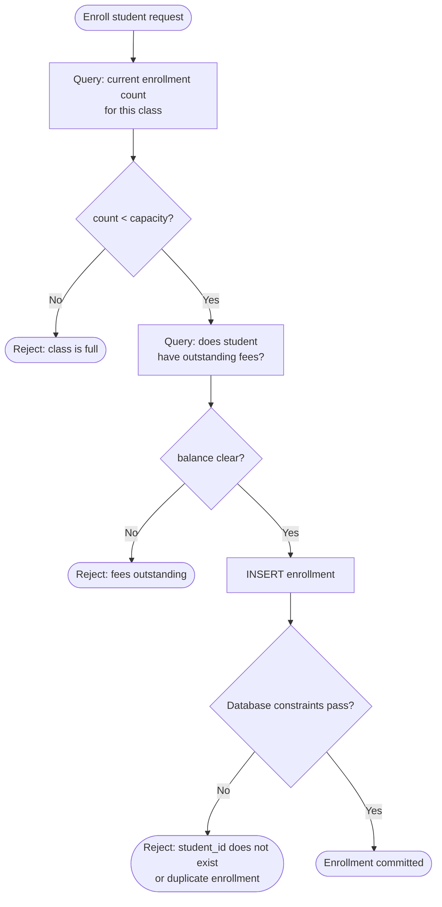

# Business Rule Enforcement

**Step 1: Data Modeling & Schema Design**

## Mental Model

You are designing an enrollment system. Two rules come out of the requirements:

> "Every enrollment must reference a valid student."
> "A student can only enroll if the class isn't full."

Both look like validation. Both feel like they belong in a service method. But they are enforcing fundamentally different things, and putting them in the same place is the mistake.

The first rule is a fact about the data itself. An enrollment that does not reference a real student is structurally broken — it is meaningless regardless of when or how it was written. This rule needs to survive every write path: your API, a migration script, a background job, a data engineer running SQL directly during an incident. The only layer that sees every write is the database.

The second rule is a question about current system state. "Is the class full?" requires counting existing rows. The answer changes as students enroll and drop. The database cannot evaluate that as a column condition — it needs your service layer to query the state and decide whether the action is permitted right now.

**Database constraints enforce what the data is. Application logic enforces whether an action is currently allowed.**

## Database Constraints

Constraints are rules the database evaluates on every write, from every source — API, script, admin tool, or direct session. If the constraint fails, the write is rejected. No exceptions.

| Constraint | Enforces | Example |
|---|---|---|
| `NOT NULL` | Column must always have a value | `enrolled_at NOT NULL` |
| `UNIQUE` | No two rows share this value | `email UNIQUE` |
| `FOREIGN KEY` | Reference must point to a real row | `student_id REFERENCES students(id)` |
| `CHECK` | Column satisfies a custom condition | `CHECK (due_date > enrolled_at)` |

These rules share a property: they can be fully evaluated from the column values and references in the row being written. They do not need to know anything else about the current state of the system.

### NOT NULL

`NOT NULL` enforces that a column always carries a value. Any write that omits it or sets it to null is rejected before the row is committed.

In the enrollment system, `enrolled_at NOT NULL` means every row in the enrollments table has a timestamp. An enrollment without a timestamp is not just incomplete — it is meaningless. When did this happen? The column is not optional data. It is part of what makes the row a valid record.

The constraint does not care where the write came from. A migration script that inserts rows without `enrolled_at` hits the same rejection as an API call that forgets the field.

### UNIQUE

`UNIQUE` enforces that no two rows in the table share the same value for a column (or combination of columns). Any write that would create a duplicate is rejected.

In a users table, `UNIQUE` on `email` means the database itself prevents two accounts from sharing an address. Not just your signup form — the database. If a background job imports users from an external source and one of those emails already exists, the write fails. No second account is created. The application does not need to remember to check; the database rejects the duplicate unconditionally.

`UNIQUE` can also apply across multiple columns. In the enrollments table, you might want `UNIQUE (student_id, class_id)` — the same student should not appear in the same class twice. That constraint catches duplicate enrollments regardless of which code path issued the write.

### FOREIGN KEY

A foreign key enforces referential integrity: a value in one table must reference a row that actually exists in another. Any write that references a non-existent row is rejected.

This is the constraint from the opening scenario. `student_id REFERENCES students(id)` means an enrollment can only exist if the student it references exists. If a student is hard-deleted and their enrollments are not cleaned up first, the database blocks the deletion (`ON DELETE RESTRICT`). Or it nullifies the reference (`ON DELETE SET NULL`). Or it cascades the deletion to their enrollments too (`ON DELETE CASCADE`). You choose the behavior explicitly — the database enforces it automatically.

Foreign keys are what prevent orphaned rows: records that reference something that no longer exists. Without them, deleted parents leave behind broken children that silently produce nulls or missing data downstream.

### CHECK

`CHECK` enforces a custom condition that every row must satisfy. Any write where the condition evaluates to false is rejected.

In the enrollment system, `CHECK (due_date > enrolled_at)` means a deadline can never be set before the enrollment happened. A migration script that copies old data with inverted dates, a bug in a form that transposes the fields — the database rejects both. The row either satisfies the condition or it does not exist.

`CHECK` handles rules that are expressible as a column-level condition: a number must be positive, a status must be one of a fixed set of values, a date must follow another date on the same row. It cannot reference other rows or tables — that kind of rule belongs in application logic.

## Application Logic

Some rules cannot be expressed as a column condition. They require querying state, counting rows, checking related data, or evaluating context that changes over time. These live in your service layer and run before the write is issued.

The enrollment system has several rules of this kind:

**Capacity check.** "A student can only enroll if the class isn't full." This requires `SELECT COUNT(*) FROM enrollments WHERE class_id = ?` and comparing the result to the class capacity. The answer changes as students enroll. No constraint can express this — the database would need to count other rows to evaluate it, which is not what constraints do.

**Temporal availability.** "A booking can only be made for a future time slot." Knowing whether a slot is in the future requires comparing against the current time in the right timezone. That is application context, not a column condition.

**Tier and permission rules.** "Only premium users can enroll in more than 3 classes simultaneously." This requires joining the user's subscription record and counting their active enrollments. Two queries, combined with business logic that the database cannot express as a constraint.

**Balance and credit checks.** "A student can only register if they have no outstanding fees." This requires checking a separate financial record. The enrollment table has no column that captures this — it requires a cross-table query evaluated at the moment of the write.

Application logic runs first and decides whether to attempt the write. The database constraints run at write time and decide whether the row is structurally valid. Both layers do their job. The application layer handles the state-dependent questions. The database layer handles the structural guarantees that must hold no matter what wrote the data.

This is why both layers exist. The database constraint is not a fallback for when the application forgets to check. The application check is not a replacement for the constraint. They enforce different things, at different layers, for different reasons.

:::evaluator
You are designing an online library system. For each requirement below, decide whether it belongs as a database constraint or application logic — and explain why.

1. Every book must have an ISBN.
2. A member can only have 3 active loans at a time.
3. A loan's due date must be after its checkout date.
4. A member can only borrow a book if they have no overdue loans.
:::
