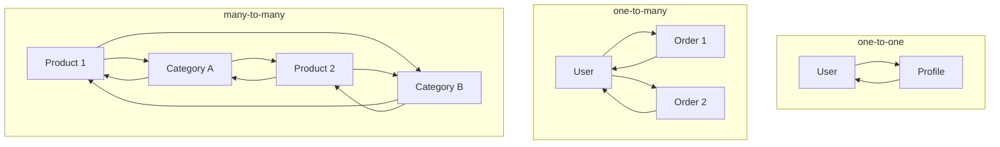
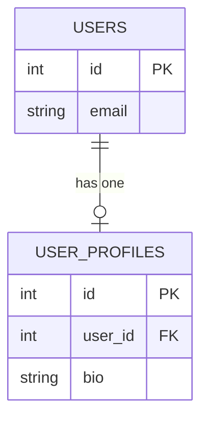
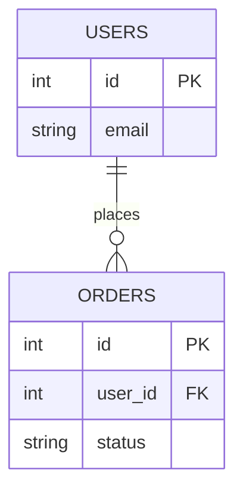
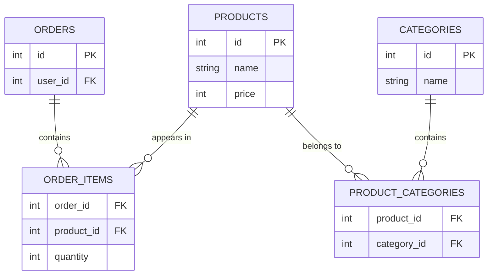

# Entity-Relationship Modeling

**Step 1: Data Modeling & Schema Design**

## Mental Model

Before you write a single table, you need to understand what your system is actually tracking and how those things connect to each other. Skip this step and your schema will tell you what it can store -- but not what your product actually needs.

Take an e-commerce system. The requirements mention users, orders, products, and categories. Each of these is something the system tracks independently. A user exists whether or not they have placed an order. A product exists whether or not it appears in any order. These are your entities.

But entities alone are not enough. A user *places* orders. A product *belongs to* categories. An order *contains* products. These connections -- relationships -- are just as important as the entities themselves, because most of the interesting questions your application asks will span more than one entity.

The process of naming your entities, reading the relationships between them, and deciding how each relationship maps to a table structure is entity-relationship modeling. Done before you write schema, it prevents the kind of structural mistakes that require dropping columns and rebuilding tables later.

**Name the things your system tracks. Then name how they connect.**

## Entities

An entity is any distinct thing your system needs to track independently. Given a requirement like:

> "Users can browse products, add them to a cart, and place orders. Each product belongs to one or more categories."

Start by pulling out the nouns: users, products, cart, orders, categories. These are your candidates. But not every noun becomes an entity -- some are just attributes of another thing. Three questions help you decide:

**Can it exist on its own?** A user exists whether or not they have placed an order. A product exists whether or not it is in anyone's cart. These pass. "Email" does not exist independently -- it is a fact about a user. It becomes a column, not a table.

**Would you need a separate row for each instance?** If you would need to store 500 users, you need 500 rows -- that is a table. If you store one email per user, that is a column on the users table.

**Does the system need to ask questions about it directly?** "Give me all orders placed this week." "Which products are in this category." If the system needs to query it by itself, it is an entity. If it only ever appears as part of something else, it is probably an attribute.

Applying those tests to the e-commerce requirements:

| Candidate | Entity or attribute? | Reason |
|---|---|---|
| User | Entity | Exists independently, has its own attributes, queried directly |
| Product | Entity | Exists independently, appears in many orders and categories |
| Order | Entity | Exists independently, has status and history, queried directly |
| Category | Entity | Exists independently, groups many products |
| Cart | Depends | If carts persist and are queried, entity. If cart is just a session, it may not need a table at all |
| Email | Attribute | A fact about a user, not independently tracked |
| Price | Attribute | A fact about a product, stored as a column |

The cart row is worth noticing: context changes the answer. An entity is not a fixed property of a noun -- it depends on what the system needs to do with it.

Once you have your entities confirmed, each becomes a table. Each attribute becomes a column. And each entity needs a primary key -- a unique identifier for every row -- so that other tables can reference a specific instance later.

| Entity | Key attributes |
|---|---|
| User | id, email, created_at |
| Profile | id, bio, avatar_url |
| Order | id, status, created_at |
| Product | id, name, price |
| Category | id, name |

With entities established, the next question is how they connect.

:::evaluator
You are designing a database for a hospital system. The requirements say:

"Doctors treat patients. Each doctor has a specialty and a license number. Patients have a date of birth and a phone number. The hospital needs to record which doctor treated which patient on which date."

Pull out the candidate nouns and apply the three identification tests to each. Which are entities? Which are attributes? Is there anything that does not fit cleanly into either -- and if so, what does that tell you?
:::

## Relationships

Entities do not exist in isolation. A relationship describes how one entity connects to another. Every relationship has a cardinality -- how many instances of each entity can exist on each side of the connection.

There are three patterns:

| Pattern | What it means | Example |
|---|---|---|
| One-to-one | Each A has one B, each B has one A | A user has one profile |
| One-to-many | Each A has many Bs, each B belongs to one A | A user places many orders |
| Many-to-many | Each A has many Bs, each B has many As | A product belongs to many categories |

To identify the pattern, read the relationship in both directions. One direction alone can mislead you. "Products have categories" sounds like one-to-many until you read it back: a category contains many products, and a product belongs to many categories. Both sides are "many" -- it is many-to-many.

The test is always the same two questions:

> Can one [A] connect to many [B]?
> Can one [B] connect to many [A]?

| First question | Second question | Pattern |
|---|---|---|
| No | No | One-to-one |
| Yes | No | One-to-many |
| Yes | Yes | Many-to-many |



Read every relationship in both directions before settling on a pattern. The cardinality you land on determines exactly how you structure the schema.

:::evaluator
Read each of these requirements in both directions and identify the cardinality. Explain how you applied the two-question test to reach your answer for each.

1. "A blog post can have many comments, and each comment belongs to one post."
2. "Authors write books. A book can have multiple authors, and an author can write multiple books."
3. "Each employee is assigned to exactly one parking spot, and no two employees share a spot."
:::

## Schema

Once you have your entities and their cardinalities, you can build the schema. Each entity becomes a table. The cardinality of each relationship then tells you how to connect them -- which table gets the connecting column, and what rules enforce the shape.

### One-to-One

A user has one profile. The profile needs to know which user it belongs to, so `user_profiles` gets a `user_id` column that references `users.id`. That column is a foreign key -- it is how one row in one table points to a specific row in another.

A foreign key alone does not make this one-to-one. Without any further constraint, two profile rows could both reference the same user. That is a one-to-many structure. Adding `UNIQUE` on `user_id` tells the database to reject any second profile row for the same user -- now the constraint enforces the relationship.



:::evaluator
A system tracks users and their notification settings. Each user has exactly one settings record, and no settings record exists without a user.

Which table holds the foreign key? Write out what the relevant column definition looks like, including the constraint that makes it one-to-one. Then explain: what would happen to the relationship if that constraint were removed?
:::

### One-to-Many

A user places many orders. Each order belongs to exactly one user. The foreign key goes on the "many" side -- `orders` gets a `user_id` column referencing `users.id`.

Multiple order rows can share the same `user_id`. That is what makes it one-to-many: one user row, many order rows pointing back to it. No additional constraint is needed -- the structure already allows exactly this shape.



:::evaluator
In a blogging system, each post is written by one author, but one author can write many posts.

Where does the foreign key go -- on `posts` or on `authors`? Explain why it goes there and not the other way. Then describe what the data looks like in the table for two authors who have each written three posts.
:::

### Many-to-Many

A product belongs to many categories, and a category contains many products. Neither table can hold the foreign key cleanly.

Here is what happens when you try. You add `category_id` to `products`. A laptop belongs to Electronics -- fine. Then it also belongs to Computers -- you add `category_id_2`. Then it goes on sale -- you add `category_id_3`. Now a fourth category comes along and there is no column for it. You have to alter the table to add one.

But that is not even the worst part. Every query that asks "which categories does this product belong to?" now has to check three separate columns:

```sql
WHERE category_id = ? OR category_id_2 = ? OR category_id_3 = ?
```

And it is wrong the moment a fourth column exists. The column structure cannot represent a variable-length relationship -- you have forced a fixed number of slots onto something that has no fixed limit.

The solution is a junction table. Instead of columns on either parent, you create a third table that holds one row per pairing:

| product_id | category_id |
|---|---|
| 1 | 10 (Electronics) |
| 1 | 11 (Computers) |
| 1 | 12 (Sale) |
| 1 | 13 (New Arrivals) |

Adding a fourth category is a new row. Removing one is a deleted row. Querying all categories for a product is a single join. The relationship lives in the junction table, not in either parent.

The same pattern applies to products and orders. An order contains many products, and a product appears in many orders -- so `order_items` is the junction table between them. It also carries `quantity`, which is an attribute of the relationship itself: it describes how many of a product are in a specific order, not a fact about either the order or the product alone.



:::evaluator
A university needs to track student course enrollments. Each student can enroll in many courses, and each course has many students enrolled.

Explain why adding `course_id_1`, `course_id_2`, `course_id_3` columns to `students` is the wrong structure -- specifically what breaks when a student enrolls in a fourth course, and what goes wrong with queries before that happens. Then describe the junction table you would use instead, and name one attribute that belongs on the junction table rather than on either parent.
:::

:::evaluator
You are designing a database for a recipe management application. The requirements include:

1. Each recipe belongs to exactly one author (a registered user).
2. A recipe can have multiple ingredients, and the same ingredient can appear in many recipes -- each with a different quantity.
3. Each ingredient belongs to one ingredient category (such as "dairy" or "produce").
4. A recipe can be tagged with multiple dietary labels (such as "vegan" or "gluten-free"), and each label applies to many recipes.
5. Each user can save recipes to a personal collection, and the same recipe can be saved by many users.

For each requirement, identify the cardinality, name the entities involved, and describe the table structure you would use to implement it. For requirements 2 and 5, explain why a foreign key column on either parent table is not a sufficient structure.
:::
