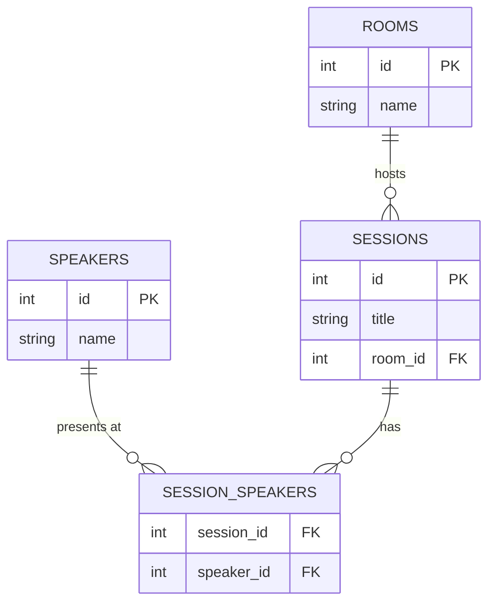

# Entity-Relationship Modeling

**Step 1: Data Modeling & Schema Design**

## Mental Model

You are building a conference scheduling app. The requirements say:

> "Each session takes place in one room. Speakers present at sessions. Attendees register for sessions."

So you start a `sessions` table and add a `speaker_id` column. The foreign key points to a `speakers` table. Everything compiles, the first demo works, and then the product manager says two speakers will co-present the opening keynote. You add `speaker_id_2`. Then a third presenter joins. You add `speaker_id_3` and hard-code a rule that sessions have at most three speakers. Six months later you delete the column and start over.

The mistake was not the foreign key. The mistake was misreading the relationship. "Speakers present at sessions" is not one speaker per session -- it is any number of speakers per session, and any speaker appearing in multiple sessions. That relationship has a different shape, and a different shape requires a different table structure.

Every relationship between entities has a cardinality: how many instances on each side can relate to instances on the other. One room hosts many sessions, but each session has exactly one room -- that is one-to-many. One speaker can present in many sessions, and one session can have many speakers -- that is many-to-many. Cardinality is not a label you assign after the fact. It is a property you read from the requirements before you write a single column definition.

**Cardinality tells you what relationship the data actually has. Schema structure enforces it.**

## Cardinality

Cardinality is a fact you read from the requirements, not a choice you make. The pattern to look for: when you ask "how many of A can relate to one B, and how many of B can relate to one A?", one of three answers emerges.

| Relationship | Pattern | Signal in requirements |
|---|---|---|
| One-to-one | Each A has at most one B, and vice versa | "Each user has one profile", "each order has one invoice" |
| One-to-many | Each A has many Bs, but each B belongs to one A | "Each customer places many orders", "each post has many comments" |
| Many-to-many | Each A has many Bs, and each B has many As | "Speakers present at sessions", "students enroll in courses", "tags apply to articles" |

Requirements hide cardinality inside verbs. "A customer places orders" is one-to-many. "Students enroll in courses" is many-to-many -- a student takes multiple courses and a course has multiple students. "A user has a profile" is one-to-one. The verb and the implied plurality are the signal.

Many-to-many is the easiest to misread because requirements often only describe one direction. "Sessions have speakers" sounds like one-to-many until you read it the other way: "speakers appear in multiple sessions." Both directions together confirm many-to-many. Always read the relationship in both directions before settling on a cardinality.

## Schema Translation

Cardinality maps directly to table structure. One-to-one and one-to-many translate to a foreign key column. Many-to-many always requires a junction table.

**One-to-many**: The "many" side holds the foreign key. An order belongs to one customer, so `orders.customer_id` references `customers.id`. Many order rows can share the same `customer_id`. The parent (customer) is referenced; the child (order) holds the key.

**One-to-one**: The foreign key sits on whichever side you want to keep optional or separate. A user's extended profile goes in a `user_profiles` table with `user_id REFERENCES users(id) UNIQUE`. The `UNIQUE` constraint on the foreign key is what makes it one-to-one instead of one-to-many.

**Many-to-many**: No column on either side can hold multiple references without breaking. Comma-separated IDs, JSON arrays, and nullable `speaker_id_2` columns are all symptoms of a misread cardinality. The solution is a junction table that holds one row per pairing.

The `SESSION_SPEAKERS` junction table holds one row per speaker-session pairing. Adding a second speaker is a new row, not a new column. Removing one is a deleted row. The relationship lives in the junction, not in either parent table.

Junction tables can carry their own attributes. If the app tracks which speaker is the primary presenter for a session, that fact belongs on `SESSION_SPEAKERS` -- it describes the relationship between the two entities, not either entity alone.

:::evaluator
You are designing a database for a recipe management application. The requirements include:

1. Each recipe belongs to exactly one author (a registered user).
2. A recipe can have multiple ingredients, and the same ingredient can appear in many recipes -- each with a different quantity.
3. Each ingredient belongs to one ingredient category (such as "dairy" or "produce").
4. A recipe can be tagged with multiple dietary labels (such as "vegan" or "gluten-free"), and each label applies to many recipes.
5. Each user can save recipes to a personal collection, and the same recipe can be saved by many users.

For each requirement, identify the cardinality, name the entities involved, and describe the table structure you would use to implement it. For requirements 2 and 5, explain why a foreign key column on either parent table is not a sufficient structure.
:::
