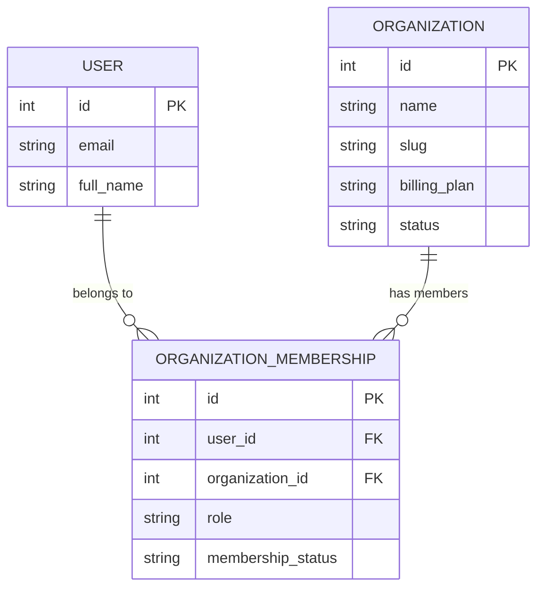
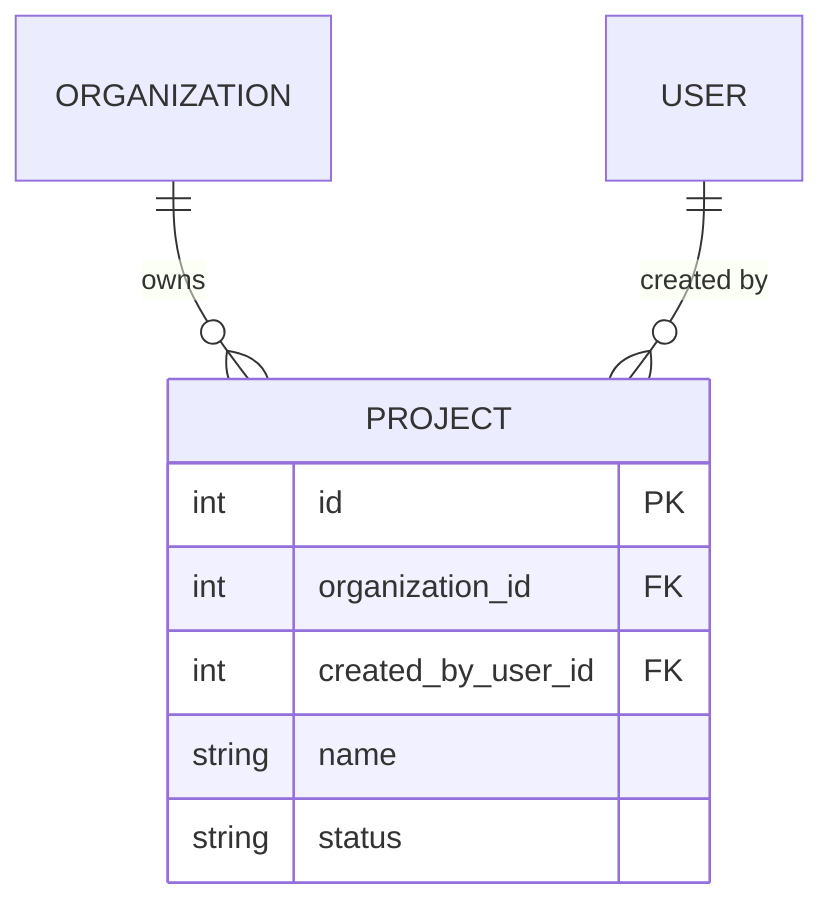
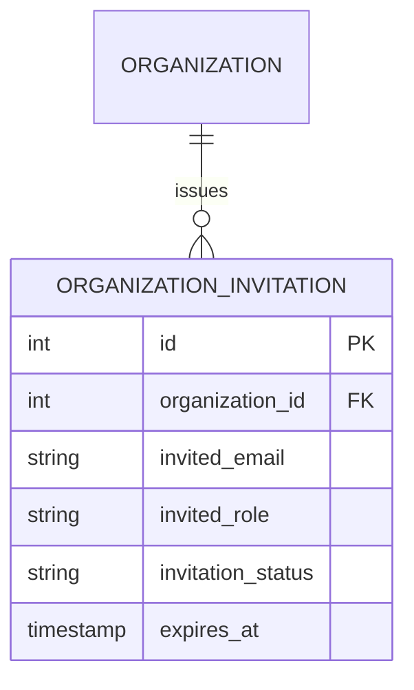
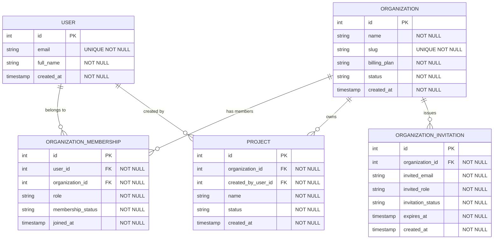

# Design a Multi-Tenant SaaS Schema - Walkthrough

## How to Approach This

### The Core Insight

The hard part in a multi-tenant schema is not creating an `organizations` table. It is deciding where the tenant boundary actually lives. Many candidates attach `organization_id` to a few obvious tables, or worse, treat the user row itself as the tenant boundary. That breaks as soon as one person belongs to multiple organizations.

The key insight is this: a user identity is global, but access and business data are tenant-scoped. Membership is the bridge between those two worlds. Every organization-owned record must be traceable to exactly one organization, and every query that touches tenant data must pass through that boundary on purpose.

### The Mental Model

Think of the system as a shared office building rented by many companies.

The building itself is your application and database. Each company rents its own suite. A person can hold one building badge, that is the global `User`, and still have access to several suites, that is `OrganizationMembership`. The suite number does not belong on the person's badge, because the same person may work with more than one company in the building.

Projects, invitations, and other business records are like documents stored inside a specific suite. Even though the filing cabinets sit in the same building, each folder must be stamped with the suite that owns it. If a folder is missing that stamp, or if you check access based only on the person's badge, documents will drift across company boundaries.

### How to Decompose This in an Interview

Before drawing anything, ask yourself:

1. Which records are global across the whole application, and which records belong to exactly one tenant?
2. How does a user gain access to a tenant, and what changes when that access is revoked?
3. Which names or identifiers should be unique globally, and which should only be unique inside one organization?

Start with the boundary, not the screens. If you cannot prove which organization owns a row, the rest of the schema will be guesswork.

## Building the Design

### Step 1: Separate Global Identity from Tenant Membership

Start by splitting "who this person is" from "which tenant this person can enter."

In the office-building analogy, the badge is global. It identifies the person anywhere in the building. But suite access is granted separately, because the same person might work with Company A, advise Company B, and be blocked from Company C.

That gives you three foundational tables:

- `users`, for global identity such as email and profile fields
- `organizations`, for the tenant itself
- `organization_memberships`, for the relationship between a user and one organization

The membership row is where tenant-specific role and lifecycle state belong. An `owner` in one organization may be only a `member` in another. That fact belongs to the relationship, not to the user record.

> **What you're learning:** When a fact changes per tenant, it belongs on the membership row, not on the global user row.

:::evaluator
Why is `organization_memberships` a separate table instead of putting `organization_id` and `role` directly on `users`?
:::

### Step 2: Stamp Every Tenant-Owned Record with Its Organization

Now model the business data. In this scenario, `projects` are the core tenant-owned resource.

Inside the building, every project folder lives inside one suite. That means the row itself should carry `organization_id`. Do not rely on joining through the creator user to discover ownership later. A project may be created by one member, edited by another, and still belong to the same organization the whole time.

This is the rule that keeps tenant isolation visible in the schema: if a record belongs to one tenant, store that tenant reference directly on the record.

This also makes the common reads obvious:

- list projects with `WHERE organization_id = ?`
- validate access by checking membership in the same organization
- reject writes when the active organization and the row's `organization_id` do not match

> **What you're learning:** Tenant ownership should be explicit on the row that is owned, not inferred indirectly from some other relationship.

:::evaluator
If `projects` did not store `organization_id` directly, what extra joins or bugs would appear when you try to prove which tenant owns a project?
:::

### Step 3: Model Tenant-Scoped Roles, Invitations, and Uniqueness

Once the boundary is clear, add the rows that control who may enter and what names make sense inside a suite.

Invitations belong to an organization because they are asking someone to join a specific tenant. A pending invite may exist before a user row does, so it should not depend on `user_id`. Store the invited email and the target organization.

Uniqueness also needs tenant awareness. In a shared building, two companies can both have a room called "Marketing". That means `projects.name` should be unique per organization, not globally. The same idea applies to membership and invites:

- one membership per `(organization_id, user_id)`
- one active invite per `(organization_id, invited_email)`
- one project name per `(organization_id, name)`

Those composite constraints are what keep tenants isolated without forcing globally unique business names.

> **What you're learning:** In multi-tenant systems, many business identifiers are only unique inside the tenant boundary.

:::evaluator
Why should project-name uniqueness be `(organization_id, name)` instead of a global unique constraint on `name`?
:::

### Step 4: Make Access Checks Flow Through Membership

At this point, you have the raw tables. Now connect them into the actual access question: can user U access project P in organization O?

In the office-building analogy, you do not decide access by asking whether the person has a badge. Everyone with an account has a badge. You decide access by checking whether that badge opens the suite that owns the folder.

That means the lookup should always tie together:

1. the active organization
2. a valid membership for that organization
3. the target project that belongs to that organization

For example, the application should be able to answer access with a join shaped like:

- `organization_memberships.user_id = ?`
- `organization_memberships.organization_id = ?`
- `organization_memberships.membership_status = 'active'`
- `projects.id = ?`
- `projects.organization_id = organization_memberships.organization_id`

When a user is removed from one organization, deleting or deactivating that one membership row should be enough to remove access to every project in that tenant. Nothing on the global user row needs to change.

> **What you're learning:** Revocation is simple only when tenant access is centralized in one relationship table.

:::evaluator
Walk through the joins or predicates you would use to answer: can user U access project P under organization O?
:::

### Step 5: Add Constraints That Keep Tenant Boundaries Honest

Constraints are the locks on each suite door. They protect the boundary even when a buggy admin script or a rushed migration bypasses the normal application path.

The important constraints here are:

- `users.email` unique globally, because identity is global
- `organizations.slug` unique globally, because tenant routing usually uses one canonical slug
- `organization_memberships (organization_id, user_id)` unique
- `projects (organization_id, name)` unique
- `organization_invitations (organization_id, invited_email)` unique for active invites, or approximated with a composite unique plus status rules
- foreign keys from `projects.organization_id` and `organization_invitations.organization_id` back to `organizations.id`

There is one more subtle integrity rule: if `projects.created_by_user_id` is present, that user should also be an active member of the same organization. A simple foreign key cannot prove that by itself. Call it out as application-layer validation, or model composite keys if you want stricter enforcement.

> **What you're learning:** The tenant boundary is not only a modeling concept. It becomes a set of explicit uniqueness rules, foreign keys, and scoped query patterns.

:::evaluator
Name two database constraints that matter in this schema and explain the exact cross-tenant bug each one prevents.
:::

## The Complete Schema

Recommended constraints to call out with this schema:

- `UNIQUE(users.email)`
- `UNIQUE(organizations.slug)`
- `UNIQUE(organization_memberships.organization_id, organization_memberships.user_id)`
- `UNIQUE(projects.organization_id, projects.name)`
- `UNIQUE(organization_invitations.organization_id, organization_invitations.invited_email)` for active invitations

## Trade-offs

### Tenant Key on Every Owned Table vs Deriving Ownership Indirectly

**Option A:** Store `organization_id` directly on each tenant-owned table such as `projects`. Reads are simple, tenant filters are obvious, and ownership is easy to audit.

**Option B:** Derive tenant ownership indirectly through the creating user or another parent row. This reduces one foreign key at write time, but it makes access checks and tenant isolation more fragile.

**Recommendation:** Store `organization_id` directly on every tenant-owned table. The extra column is cheaper than ambiguous ownership.

### Surrogate Membership IDs vs Composite Primary Keys

**Option A:** Give `organization_memberships` its own `id` plus a unique constraint on `(organization_id, user_id)`. This is easy for application code and future references.

**Option B:** Make `(organization_id, user_id)` the primary key. This encodes the natural key directly, but it makes downstream foreign keys and ORM usage more awkward.

**Recommendation:** Use a surrogate `id` plus a composite unique constraint. It preserves the tenant rule while keeping references simple.

## Common Mistakes

### Mistake 1: Treating the User Row as the Tenant Boundary

This is like printing one suite number on a person's building badge and pretending they can only ever work with one company. The moment one consultant joins two organizations, the model breaks. Keep identity global and access tenant-scoped through membership.

### Mistake 2: Forgetting to Stamp Tenant-Owned Rows with `organization_id`

This is like filing project folders in the shared lobby with no suite number on them. You can still guess ownership through extra paperwork, but sooner or later a folder ends up in the wrong hands. Put the tenant key on the owned row itself.

### Mistake 3: Making Business Names Globally Unique

This is like telling every company in the building they cannot both have a room named "Operations." That is not a real business rule. Most names only need to be unique inside one tenant, so use composite uniqueness with `organization_id`.

## Key Takeaways

1. **Identity is global, access is tenant-scoped**. Separate `users` from `organization_memberships`.
2. **Tenant ownership must be explicit**. Put `organization_id` directly on every organization-owned row.
3. **Scoped uniqueness matters**. Many names should be unique per organization, not across the whole database.
4. **Revocation should be local**. Removing one membership should remove one tenant's access without touching other tenants.
