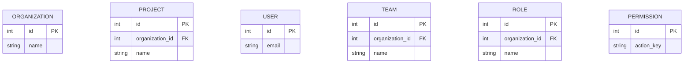
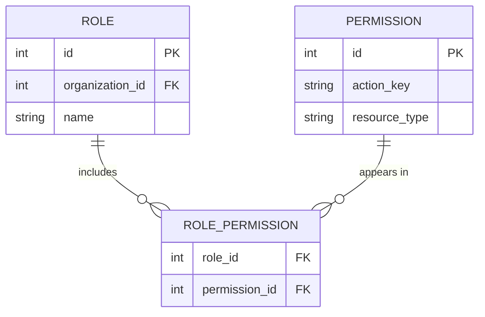
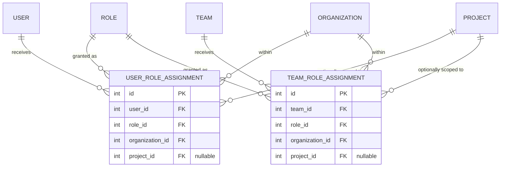
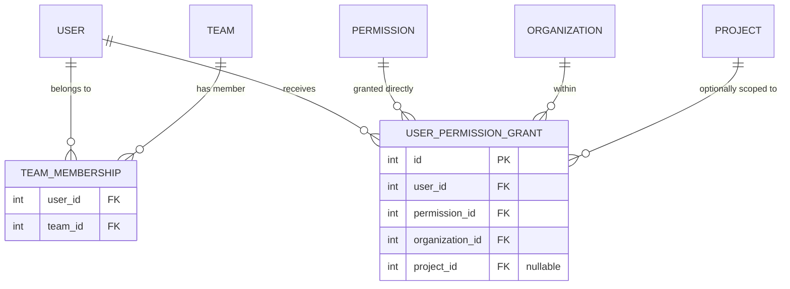
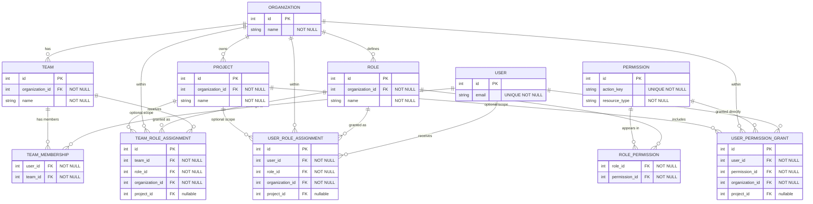

---
stepQuestions:
  - "List the core entities for this system. Which ones define reusable access rules, and which ones describe where those rules apply?"
  - "Why should Role and Permission be connected through a junction table instead of storing a string array of permissions on Role?"
  - "Why does scope belong on the assignment row rather than on the Role row itself? What breaks if you store scope on the role definition?"
  - "A user belongs to two teams and also has one direct permission grant. Walk through how you would answer: can this user edit project 42?"
  - "Name two uniqueness or integrity constraints that matter in this schema. What bug would each one prevent?"
---

# Design a Permissions and Roles Schema (RBAC) - Walkthrough

## How to Approach This

### The Core Insight

Most candidates treat RBAC as if permissions live on users or as if roles are the same thing as assignments. That works for a toy app, but it falls apart the moment the same role needs to be reused in two places with different scope.

The real design insight is that a role is a reusable badge template, while an assignment is the row that says where that badge actually opens doors. Scope belongs on the assignment, not on the role. Once you separate those two ideas, direct grants, team inheritance, and project-specific access all fit naturally.

### The Mental Model

Think about an office building access system.

The building has doors like "main lobby," "engineering floor," and "billing room." Those are your permissions: atomic things someone may or may not be allowed to do. A badge template like "Project Editor" or "Billing Admin" is a reusable bundle of door permissions. That is your role.

But the badge template alone is not enough. Someone still has to issue that badge to a person or a department, and decide whether it works everywhere in the building or only in one room cluster. That issued badge is the assignment row. The same "Project Editor" template can be issued to Team A for Project Red and to Team B for Project Blue without creating two separate roles.

This is the principle from the Data Modeling guide: when a fact belongs to the relationship, it belongs on the join row. Scope is not a property of the role in general. It is a property of this subject receiving this role in this place.

### How to Decompose This in an Interview

Before drawing anything, ask yourself:

1. What are the reusable definitions, and what are the per-user or per-team assignments?
2. Where does access inheritance come from, direct assignment, team membership, or both?
3. Which facts are global, and which facts only make sense inside an organization or project?

Start with the data shape. If the schema cannot express reusable roles, scoped assignments, and inheritance cleanly, the authorization check will turn into ad hoc application logic.

## Building the Design

### Step 1: Identify the Core Entities

Start by separating the catalog from the live assignments.

- **Organization** is the tenant boundary
- **Project** belongs to an organization and is the narrower scope
- **User** is the actor who may receive access
- **Team** is a reusable grouping of users inside an organization
- **Permission** is one atomic capability such as `project.edit`
- **Role** is a reusable bundle of permissions

At this step, the key principle is to separate things you define once from things you grant many times. Roles and permissions are definitions. Memberships and assignments are operational rows.

> **What you're learning:** Reusable definitions and live assignments should not share a table just because they both relate to access.

:::evaluator
List the entities you would create first. Which of them are reusable definitions, and which ones are actors or scope boundaries?
:::

### Step 2: Model Role Definitions as Bundles of Atomic Permissions

Now connect `roles` to `permissions`.

Think of a role as a badge template clipped together from several door rules. "Project Editor" might include `project.view` and `project.edit`. "Billing Admin" might include `billing.view` and `billing.manage`. Since one role can contain many permissions and one permission can appear in many roles, this is a many-to-many relationship.

That means you need a junction table:

- `role_permissions(role_id, permission_id)`

Do not store a string array of permission keys on the role row. Arrays are easy to demo and painful to constrain. A junction table gives you composability, uniqueness constraints, and clear joins.

> **What you're learning:** Many-to-many relationships are where normalized access control becomes reusable instead of hard-coded.

:::evaluator
Why is `role_permissions` a junction table instead of a JSON or string array column on `roles`? What integrity rule would you add to that table?
:::

### Step 3: Put Scope on the Assignment, Not on the Role

This is the heart of the design.

Imagine the office has one badge template called "Project Editor." That template should not be stamped "Project Red only" forever. If you did that, you would need to clone the role for every project. The template stops being reusable.

Instead, keep the role definition reusable and put scope on the assignment row:

- `user_role_assignments`
- `team_role_assignments`

Each assignment says:

- who received the role
- which role they received
- which organization it belongs to
- whether it applies to all projects in the organization or only one specific project

Project scope can be modeled with a nullable `project_id`. If `project_id` is null, the assignment is organization-wide. If it is set, the assignment applies only to that project.

> **What you're learning:** When the same template can be reused in many places, the location belongs on the assignment row, not the template row.

:::evaluator
Why does `project_id` belong on the assignment table instead of on the role table? What bad schema pattern appears if you put scope on `roles`?
:::

### Step 4: Add Team Membership and One-Off Direct Grants

So far, we can assign roles directly. Now add inheritance and exceptions.

**Team membership** is how a department badge reaches many people without assigning the same role row repeatedly. A `team_memberships(user_id, team_id)` table says who belongs to which team.

**Direct permission grants** handle one-off exceptions. Think of this as temporary access to one extra room without minting a brand-new badge template. For that, add `user_permission_grants`, which points directly to a permission and carries the same scope idea:

- user
- permission
- organization
- optional project

Now the access check becomes a union of three paths:

1. direct user role assignments
2. team role assignments through team membership
3. direct user permission grants

That gives you flexibility without collapsing everything onto the user row.

> **What you're learning:** Inheritance and exceptions are separate relationships. Modeling them separately keeps revocation simple and queryable.

:::evaluator
A user belongs to two teams and also has one direct permission grant. Walk through the three paths you would evaluate to answer: can this user edit project 42?
:::

### Step 5: Add Constraints and Query Shapes That Keep the Model Honest

Constraints are the building security desk. They stop bad badge records from entering the system in the first place.

Important constraints:

- `team_memberships (user_id, team_id)` should be unique
- `role_permissions (role_id, permission_id)` should be unique
- `user_role_assignments` should be unique on `(user_id, role_id, organization_id, project_id)`
- `team_role_assignments` should be unique on `(team_id, role_id, organization_id, project_id)`
- `user_permission_grants` should be unique on `(user_id, permission_id, organization_id, project_id)`
- `roles (organization_id, name)` should be unique so each organization can define role names cleanly
- `permissions.action_key` should be unique if permission keys are globally defined

There is also an important integrity rule that the database alone cannot express cleanly in a single foreign key: if an assignment names both `organization_id` and `project_id`, that project must belong to the same organization. Call this out as an application-layer validation or enforce it with a composite key strategy if you want stricter relational guarantees.

For read paths, the two key questions are:

- "Can user X do Y on project Z?" which joins direct grants and inherited grants, then applies deny-by-default
- "Who can manage billing in org O?" which expands role membership plus direct grants

For write paths, revocation should mean deleting a membership or assignment row. You should never need to edit the user record to remove inherited access.

> **What you're learning:** A strong schema makes permission checks a finite set of joins, not a pile of special cases.

:::evaluator
Name two database-level constraints you would add here and explain the exact bug each one prevents.
:::

## The Complete Schema

## Trade-offs

### One Assignment Table vs Separate User and Team Assignment Tables

**Option A:** One polymorphic assignment table with `subject_type` and `subject_id`. Fewer tables, but weaker foreign keys and more validation logic.

**Option B:** Separate `user_role_assignments` and `team_role_assignments`. Slightly more schema, but much clearer joins and stronger relational integrity.

**Recommendation:** Separate tables for Phase 1. The schema is easier to reason about and the database can enforce more of it directly.

### Compute Effective Permissions on Read vs Materialize Them

**Option A:** Compute access by joining assignments, memberships, roles, and permissions at read time. Simpler source of truth, slower as complexity grows.

**Option B:** Materialize an "effective permissions" table per user and scope. Faster checks, but now every assignment, membership, and revocation must keep the materialized table in sync.

**Recommendation:** Compute on read for this phase. The normalized model is the important concept, and it keeps revocation behavior obvious.

## Common Mistakes

### Mistake 1: Storing Permission Arrays Directly on Users

This is like scribbling room numbers onto each employee's badge by hand. It works until someone changes departments, joins a team, or needs the same access pattern as ten other people.

**Fix:** Keep permissions atomic and reusable. Bundle them through roles, then assign the role.

### Mistake 2: Putting Scope on the Role Definition

If "Project Editor" has a `project_id` column, you no longer have one reusable badge template. You have a pile of nearly identical roles, one per project.

**Fix:** Keep role definitions reusable and put `project_id` on the assignment row.

### Mistake 3: Rewriting the User Record to Revoke Inherited Access

If a user loses access because they left Team A, you should remove one membership row. If your design requires editing a cached permission blob on the user, the source of truth is in the wrong place.

**Fix:** Let inheritance come from joins, and let revocation mean deleting the relationship row that granted the access.

### Mistake 4: Using Direct Permission Grants as a Substitute for Roles

One-off exceptions are useful. Building the whole system out of exceptions is not. You end up with a badge desk that issues custom access one person at a time and nobody can explain why.

**Fix:** Use direct grants sparingly for exceptions. Keep the common paths inside reusable roles.

## Key Takeaways

1. **Roles are templates, assignments are grants** - reusable access definitions and live grants should be separate tables
2. **Scope lives on the relationship** - project-specific access belongs on the assignment row, not on the role definition
3. **Inheritance is data, not magic** - team membership plus team role assignments is how access flows to users
4. **Exceptions need their own path** - direct permission grants handle edge cases without polluting role definitions
5. **Revocation should delete a row** - if access removal requires rewriting user blobs, the schema is carrying the wrong source of truth
